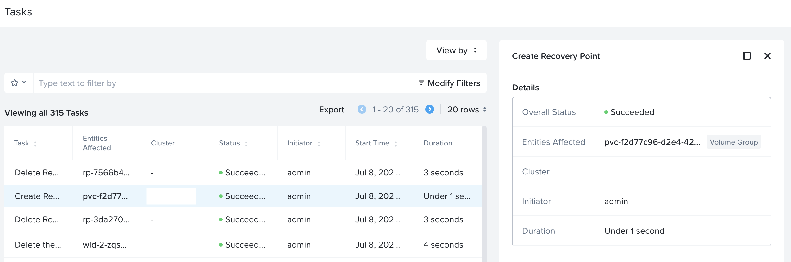
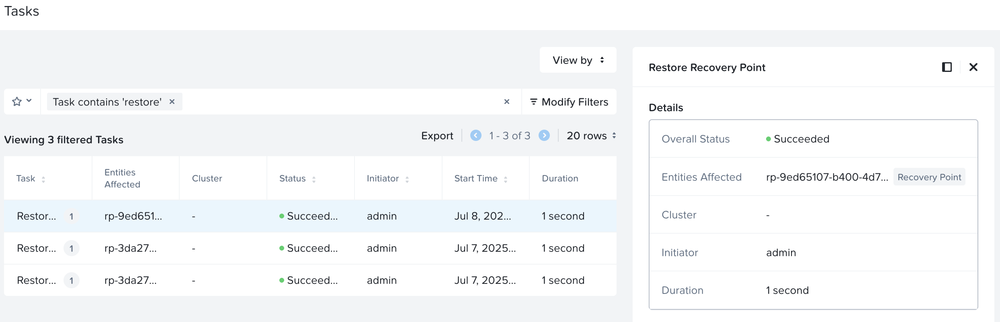

# Recovering Application within the same K8S Cluster

In this section we will deploy a sample workload, snapshot the Application components and recover.

1. Same namespace recovery
2. Cross namespace recovery


## Deploying a Sample Application

1.  On `VSCode` menu, select ``Terminal`` > ``New Terminal``

2.  Browse to ``ndk`` directory

    === ":octicons-command-palette-16: Command"
    
         ```bash
         cd $HOME/ndk
         ```

3. Source the .env file

    === ":octicons-command-palette-16: Command"
    
         ```bash
         source .env
         ```

4. Change to default namespace
    
    === ":octicons-command-palette-16: Command"
    
         ```bash
         kubens default
         ```

5. Create a stateful workload
   
    === ":octicons-command-palette-16: Command"
    
         ```bash
         kubectl apply -f - <<EOF
         apiVersion: v1
         kind: PersistentVolumeClaim
         metadata:
           labels:
             app: app1
           name: az-claim-1
         spec:
           accessModes:
             - ReadWriteOnce
           resources:
             requests:
               storage: 1Gi
         EOF
         kubectl apply -f - <<EOF
         apiVersion: v1
         kind: Pod
         metadata:
           name: app-1
           labels:
             app: app1
         spec:
           containers:
           - name: app
             image: docker.io/library/busybox:1.36.1
             command: ["/bin/sh"]
             args: ["-c", "while true; do echo $(date -u) ; sleep 5; done"]
             volumeMounts:
             - name: persistent-storage
               mountPath: /data
           volumes:
           - name: persistent-storage
             persistentVolumeClaim:
               claimName: az-claim-1
         EOF
         ```

6. Watch the workload components until they are running
    
    === ":octicons-command-palette-16: Command"

        ```bash
        kubectl get po,pvc -l app=app1
        ```

    === ":octicons-command-palette-16: Sample command"
        
        ```bash hl_lines="2 5"
        NAME        READY   STATUS    RESTARTS   AGE
        pod/app-1   1/1     Running   0          2m

        NAME                               STATUS   VOLUME                                     CAPACITY   ACCESS MODES   STORAGECLASS     VOLUMEATTRIBUTESCLASS   AGE
        persistentvolumeclaim/az-claim-1   Bound    pvc-f2d77c96-d2e4-42b3-b3d6-aa828f9e45e6   1Gi        RWO            nutanix-volume   <unset>                 2m
        ```

7.  Once the pvc and pod are running, inject some data into the persistent storage
    
    === ":octicons-command-palette-16: Command"

        ```bash
        kubectl exec -it app-1 -- /bin/sh -c 'for i in $(seq 1 10000); do echo "foobar" >> /data/abc.txt;done'
        ```

Now we have a stateful workload which we can replicate and recover using NDK

## NDK Recover to the Same Namespace

!!! tip

    NDK uses labels to select kubernetes resources to act upon. 


1. Define a NDK ``Application`` custom resource to replicate our deployed application with label ``app1``

    === ":octicons-command-palette-16: Command"
    
         ```bash
         kubectl apply -f - <<EOF
         apiVersion: dataservices.nutanix.com/v1alpha1
         kind: Application
         metadata:
           name: app-1
         spec:
           applicationSelector:                      # Note if left blank, it will include all resources in the namespace
             resourceLabelSelectors:
             - labelSelector:
                 matchLabels:
                   app: app1
         EOF
         ```

2. Take a local cluster snapshot of the ``app1`` application
   
    === ":octicons-command-palette-16: Command"
    
         ```bash
         k apply -f - <<EOF
         apiVersion: dataservices.nutanix.com/v1alpha1
         kind: ApplicationSnapshot
         metadata:
           name: app1-snap
         spec:
           source:
             applicationRef:
               name: app-1                           # This is Application reference for the snapshot operation
           expiresAfter:  48h
         EOF
         ```

3. View the progress
   
    === ":octicons-command-palette-16: Command"
 
         ```bash
         kubectl get applicationsnapshot -w
         ```
         ```bash
         kubectl describe applicationsnapshot.dataservices.nutanix.com/app1-snap
         ```
         

    === ":octicons-command-palette-16: Command output"
     
          ```text hl_lines="5" title="Wait until the status of snapshot becomes true"
          $ k get applicationsnapshot -w

          NAME        AGE   READY-TO-USE   BOUND-SNAPSHOTCONTENT                      SNAPSHOT-AGE
          app1-snap   11s   false          asc-8af85cca-3da7-468c-96fb-db54ec2cf940   
          app1-snap   37s   true           asc-8af85cca-3da7-468c-96fb-db54ec2cf940   36s
          ```
          ```text hl_lines="24 26" title="Observe the Application components that are included and status"
          Name:         app1-snap
          Namespace:    default
    
          API Version:  dataservices.nutanix.com/v1alpha1
          Kind:         ApplicationSnapshot
          Metadata:
            Creation Timestamp:  2025-07-08T01:34:41Z
          
          Spec:
            Expires After:  48h0m0s
            Source:
              Application Ref:
                Name:  app-1
          Status:
            Bound Application Snapshot Content Name:  asc-3c1e253a-266d-46fd-8559-d8aa189fea78
            Creation Time:                            2025-07-08T01:35:13Z
            Expiration Time:                          2025-07-10T01:35:13Z
            Ready To Use:                             true
            Summary:
              Snapshot Artifacts:
                cilium.io/v2/CiliumEndpoint:
                  Name:  app-1
                v1/PersistentVolumeClaim:
                  Name:  az-claim-1
                v1/Pod:
                  Name:  app-1
          Events:
            Type    Reason                   Age    From  Message
            ----    ------                   ----   ----  -------
            Normal  AcquireAppConfigWaiting  2m47s  NDK   ApplicationSnapshotContent's app config acquisition is waiting to be processed
            Normal  VolumeSnapshotWaiting    2m45s  NDK   ApplicationSnapshotContent's volume snapshot phase is waiting to be processed
            Normal  FinalizeSnapshotWaiting  2m16s  NDK   ApplicationSnapshotContent's finalize phase is waiting to be processed
          ```

    ??? info "Relationship between NDK custom resources"
 
        We can observe that the ``ApplicationSnapshot`` and ``ApplicationSnapshotContent`` NDK custom resources are related.

        ``ApplicationSnapshotContent`` also shows the Nutanix infrastructure components of the ``ApplicationSnapshot`` custom resources such as Nutanix volumes.
        
        Refer to the highlighted parts in the following command output.
  
        ```bash hl_lines="4"
        kubectl get ApplicationSnapshot
    
        NAMESPACE   NAME        AGE     READY-TO-USE   BOUND-SNAPSHOTCONTENT                      SNAPSHOT-AGE
        default     app1-snap   4h33m   true           asc-8af85cca-3da7-468c-96fb-db54ec2cf940   4h33m
        ```

        ```bash hl_lines="17 18 22 23 29 31"
        kubectl get ApplicationSnapshotContent -oyaml
        
        apiVersion: v1
        items:
        - apiVersion: dataservices.nutanix.com/v1alpha1
          kind: ApplicationSnapshotContent
          metadata:
            creationTimestamp: "2025-07-08T02:00:06Z"
            finalizers:
            - dataservices.nutanix.com/app-snap
            - dataservices.nutanix.com/app-snap-content
            generation: 1
            name: asc-8af85cca-3da7-468c-96fb-db54ec2cf940
            resourceVersion: "7484635"
            uid: 9ed65107-b400-4d75-9acd-c0a7a0aede81
          spec:
            applicationSnapshotRef:
              name: app1-snap
              namespace: default
            source:
              applicationRef:
                name: app-1
                namespace: default
          status:
            applicationSnapshotSummary:
              applicationSnapshotHandle:
                name: asc-8af85cca-3da7-468c-96fb-db54ec2cf940
              volumeClaimHandleMap:
                az-claim-1: NutanixVolumes-0d77026f-f513-4b20-4c4f-822d31e0c4d4
              volumeSnapshotHandleMap:
                NutanixVolumes-0d77026f-f513-4b20-4c4f-822d31e0c4d4: 5acbcd9e-fde3-4fe5-aabd-11a4b080a044:ea8518bb-3453-4748-bbd0-713eb9358c5b
        ```


4. The NDK controller manager will also have logs of the snapshot operation. This will be useful for troubleshooting purposes
   
    === ":octicons-command-palette-16: Command"
 
         ```text
         kubectl logs -f -n ntnx-system deploy/ndk-controller-manager
         ```

    === ":octicons-command-palette-16: Command output"
     
          ```{ .text .no-copy }
          $ kubectl logs -f -n ntnx-system deploy/ndk-controller-manager

          {"level":"info","timestamp":"2025-07-08T01:35:12.909Z","caller":"applicationsnapshotcontent/asc_finalize.go:38","msg":"resource regulated: ApplicationSnapshotContent's finalize phase is waiting to be processed","controller":"applicationsnapshotcontent","controllerGroup":"dataservices.nutanix.com","controllerKind":"ApplicationSnapshotContent","ApplicationSnapshotContent":{"name":"asc-3c1e253a-266d-46fd-8559-d8aa189fea78"},"namespace":"","name":"asc-3c1e253a-266d-46fd-8559-d8aa189fea78","reconcileID":"a0cf1641-40d7-4d51-b948-10cf9bae84e0","requestId":"7566b4fa-0eda-4ffd-b34e-76daf2311148"}

          {"level":"info","timestamp":"2025-07-08T01:35:13.381Z","caller":"utils/controller.go:36","msg":"Ensuring finalizer on objects","controller":"applicationsnapshot","controllerGroup":"dataservices.nutanix.com","controllerKind":"ApplicationSnapshot","ApplicationSnapshot":{"name":"app1-snap","namespace":"default"},"namespace":"default","name":"app1-snap","reconcileID":"5af23527-5d34-4992-ab02-99ba4af2a401","finalizer":"dataservices.nutanix.com/app-snap-2a003355dcfd33a75426095a4a71154b"}
          ```

5. Observe the event ``Create Recovery Point`` operation in Prism Central 
   
    

6. Delete the app to simulate a failure
   
    === ":octicons-command-palette-16: Command"
    
         ```bash
         kubectl delete po,pvc -l app=app1 --force
         ```

7. Restore the app from ``applicationSnapshot`` custom resource
   
    === ":octicons-command-palette-16: Command"
    
         ```bash
         kubectl apply -f - <<EOF
         apiVersion: dataservices.nutanix.com/v1alpha1
         kind: ApplicationSnapshotRestore
         metadata:
           name: app1-restore
         spec:
           applicationSnapshotName: app1-snap
         EOF
         ```
         ```bash
         kubectl get applicationsnapshotrestore.dataservices.nutanix.com/app1-restore -w
         ```
    === ":octicons-command-palette-16: Command Output"
    
         ```{ .text .no-copy }
         applicationsnapshotrestore.dataservices.nutanix.com/app1-restore created
         ```
         ```text title="Wait until the status of snapshot becomes true"
         kubectl get applicationsnapshotrestore.dataservices.nutanix.com/app1-restore -w

         NAME           SNAPSHOT-NAME   COMPLETED
         app1-restore   app1-snap       false
         app1-restore   app1-snap       false
         app1-restore   app1-snap       false
         app1-restore   app1-snap       true
         ```

8. Monitor the progress of ``ApplicationSnapshotRestore`` custom resource
   
    === ":octicons-command-palette-16: Command"
    
         ```bash
         kubectl get applicationsnapshotrestore.dataservices.nutanix.com/app1-restore -w
         ```
         
    === ":octicons-command-palette-16: Command Output"
    
         ```text title="Wait until the status of restore becomes true"
         kubectl get applicationsnapshotrestore.dataservices.nutanix.com/app1-restore -w

         NAME           SNAPSHOT-NAME   COMPLETED
         app1-restore   app1-snap       false
         app1-restore   app1-snap       false
         app1-restore   app1-snap       false
         app1-restore   app1-snap       true
         ```

9. Verify if app1 pvc and pod are restored
    
    === ":octicons-command-palette-16: Command"
    
         ```bash
         kubectl get po,pvc -l app=app1
         ```
         
    === ":octicons-command-palette-16: Command Output"
    
         ```text hl_lines="4 7"
         $  kubectl get po,pvc -l app=app1

         NAME        READY   STATUS    RESTARTS   AGE
         pod/app-1   1/1     Running   0          4m53s
         
         NAME                               STATUS   VOLUME                                     CAPACITY   ACCESS MODES   STORAGECLASS     VOLUMEATTRIBUTESCLASS   AGE
         persistentvolumeclaim/az-claim-1   Bound    pvc-55a6b812-35de-4db2-b0e1-8a55e1b4e41f   4Gi        RWO            nutanix-volume   <unset>                 5m54s
         ```

10. Check if data is present within the data mount ``/data`` inside the pod

    === ":octicons-command-palette-16: Command"
    
         ```bash
         kubectl exec -it app-1 -- /bin/sh -c "wc -l /data/abc.txt"
         ```
         
    === ":octicons-command-palette-16: Command Output"
    
         ```text hl_lines="2"
         kubectl exec -it app-1 -- /bin/sh -c "wc -l /data/abc.txt"
         10000 /data/abc.txt
         ```

11. Observe the event ``Restore Recovery Point`` operation in Prism Central 
    
     

## Cross Namespace Recovery

NDK offers cross-namespace recovery capabilites. With this NKP or any supported K8s platform administrator can recover ``applicationSnapshot`` custom resource to a different namespace within the same K8s cluster.

1. Create a referenceGrant resouce to grant permission to restore specific application snapshots from one namespace to another.
   
    === ":octicons-command-palette-16: Template Command"
    
         ```bash
         kubectl apply -f - <<EOF
         apiVersion: gateway.networking.k8s.io/v1beta1
         kind: ReferenceGrant
         metadata:
           name: _reference_grant_name
           namespace: _source_namespace
         spec:
           from:
           - group: dataservices.nutanix.com
             kind: ApplicationSnapshotRestore
             namespace: _target_namespace
           to:
           - group: dataservices.nutanix.com
             kind: ApplicationSnapshot
             name: _appplication_snapshot_name
         EOF
         ```
    === ":octicons-command-palette-16: Sample Command"
    
         ```bash
         kubectl apply -f - <<EOF
         apiVersion: gateway.networking.k8s.io/v1beta1
         kind: ReferenceGrant
         metadata:
           name: cross-ns-rg
           namespace: default
         spec:
           from:
           - group: dataservices.nutanix.com
             kind: ApplicationSnapshotRestore
             namespace: restore
           to:
           - group: dataservices.nutanix.com
             kind: ApplicationSnapshot
             name: app1-snap
         EOF
         ```
    === ":octicons-command-palette-16: Command output"
    
         ```bash
         referencegrant.gateway.networking.k8s.io/cross-ns-rg created
         ```

2. Create a target namespace
   
    === ":octicons-command-palette-16: Template Command"
    
         ```bash
         kubectl create namespace restore
         kubens restore
         ```
    === ":octicons-command-palette-16: Sample Command"
    
         ```{ .text .no-copy }
         namespace/restore created

         Context "nkplb-admin@nkplb" modified.
         Active namespace is "restore".
         ```

3. Create and ``applicationSnapshotRestore`` custom resource to restore to target ``restore`` namespace

    === ":octicons-command-palette-16: Template Command"
    
         ```bash
         kubectl apply -f - <<EOF
         apiVersion: dataservices.nutanix.com/v1alpha1
         kind: ApplicationSnapshotRestore
         metadata:
          name: _restore-snapshot-name
          namespace: _target_namespace
         spec:
          applicationSnapshotName: _snapshot_name
          applicationSnapshotNamespace: _snapshot_source_namespace
         EOF
         ```

    === ":octicons-command-palette-16: Sample Command"
    
         ```bash
         kubectl apply -f - <<EOF
         apiVersion: dataservices.nutanix.com/v1alpha1
         kind: ApplicationSnapshotRestore
         metadata:
          name: cross-ns-asr
          namespace: restore
         spec:
          applicationSnapshotName: app1-snap
          applicationSnapshotNamespace: default
         EOF
         ```


5. Monitor the progress of ``ApplicationSnapshotRestore`` custom resource
   
    === ":octicons-command-palette-16: Command"
    
         ```bash
         kubectl describe applicationsnapshotrestore.dataservices.nutanix.com/cross-ns-asr
         ```
         ```bash
         kubectl get applicationsnapshotrestore.dataservices.nutanix.com/app1-restore -w
         ```

    === ":octicons-command-palette-16: Command Output"
    
         ```text title="Wait until the status of ApplicationSnapshotRestore custom resource is true"
         Name:         cross-ns-asr
         Namespace:    restore

         API Version:  dataservices.nutanix.com/v1alpha1
         Kind:         ApplicationSnapshotRestore
         Metadata:
         Creation Timestamp:  2025-07-08T05:40:31Z
         Finalizers:
             dataservices.nutanix.com/application-restore
         Generation:        1
         Resource Version:  7484636

         Spec:
         Application Snapshot Name:       app1-snap
         Application Snapshot Namespace:  default
         Status:
         Completed:  true

         Conditions:
             Last Transition Time:  2025-07-08T05:40:31Z
             Message:               
             Observed Generation:   1
             Reason:                RequestCompleted
             Status:                False
             Type:                  Progressing
             Last Transition Time:  2025-07-08T05:40:31Z
             Message:               All prechecks passed and finalizers on dependent resources set
             Observed Generation:   1
             Reason:                PrechecksPassed
             Status:                True
             Type:                  PrechecksPassed
             Last Transition Time:  2025-07-08T05:40:31Z
             Message:               Restore requests for all eligible volumes submitted
             Observed Generation:   1
             Reason:                VolumeRestoreRequestsSubmitted
             Status:                True
             Type:                  VolumeRestoreRequestsSubmitted
             Last Transition Time:  2025-07-08T05:41:32Z
             Message:               All eligible application configs restored
             Observed Generation:   1
             Reason:                ApplicationConfigRestored
             Status:                True
             Type:                  ApplicationConfigRestored
             Last Transition Time:  2025-07-08T05:41:47Z
             Message:               All eligible volumes restored
             Observed Generation:   1
             Reason:                VolumesRestored
             Status:                True
             Type:                  VolumesRestored
             Last Transition Time:  2025-07-08T05:41:47Z
             Message:               Application restore successfully finalised
             Observed Generation:   1
             Reason:                ApplicationRestoreFinalised
             Status:                True
             Type:                  ApplicationRestoreFinalised
         Finish Time:             2025-07-08 05:41:47
         Start Time:              2025-07-08 05:40:31
         ```
         ```text
         kubectl get applicationsnapshotrestore/cross-ns-asr -w
         NAME           SNAPSHOT-NAME   COMPLETED
         cross-ns-asr   app1-snap       true
         ```


6. Verify if app1 pvc and pod are restored
    
    === ":octicons-command-palette-16: Command"
    
         ```bash
         kubectl get po,pvc -l app=app1
         ```
         
    === ":octicons-command-palette-16: Command Output"
    
         ```text hl_lines="4 7"
         $  kubectl get po,pvc -l app=app1

         NAME        READY   STATUS    RESTARTS   AGE
         pod/app-1   1/1     Running   0          4m53s
         
         NAME         STATUS   VOLUME                                     CAPACITY   ACCESS MODES   STORAGECLASS     VOLUMEATTRIBUTESCLASS   AGE
         az-claim-1   Bound    pvc-9471ed41-64cb-4d57-bc62-fe94d9a3f672   1Gi        RWO            nutanix-volume   <unset>                 119s
         ```

7. Check if data is present within the data mount ``/data`` inside the pod

    === ":octicons-command-palette-16: Command"
    
         ```bash
         kubectl exec -it app-1 -- /bin/sh -c "wc -l /data/abc.txt"
         ```
         
    === ":octicons-command-palette-16: Command Output"
    
         ```text hl_lines="2"
         kubectl exec -it app-1 -- /bin/sh -c "wc -l /data/abc.txt"
         10000 /data/abc.txt
         ```

We have now successfully restored our application accross namespaces.