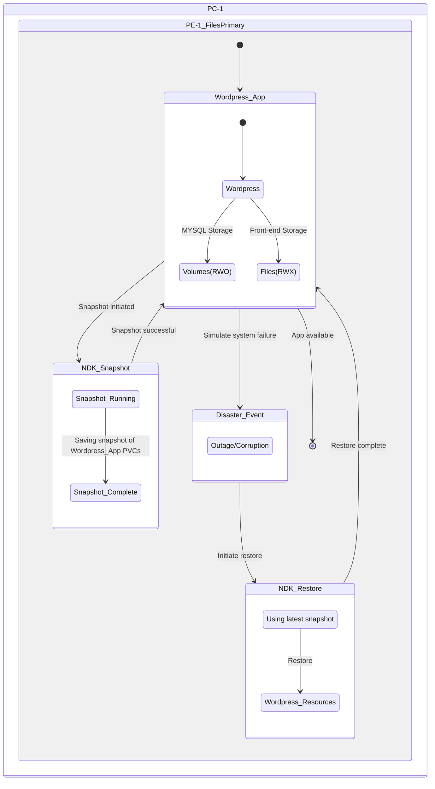

# Recovering Application within the same K8S Cluster

In this section we will deploy a sample workload, snapshot the Application components and recover.

## Pre-requisites

1. Nutanix Files Server Access for Dynamic Files SC
2. Prism Element Access for Volumes SC

## Design

In this lab, we will be replicating an application (workload) from one NKP cluster to another NKP cluster in the same Nutanix PC/PE environment. 

There is one NKP cluster hosting the workload.

We will simulate a restore process.

The workload stores data in both ``Volumes`` and Dynamic ``Files`` CSI. 

| #           | PC   | PE   | NKP Cluster          | Files Server      | K8S Namespace     |
|-------------|------|------|-----------------     |-------------------|-------------------|
| Source      | PC-1 | PE-1 | ``nkpprimary``       | ``filesprimary``  |  ``wordpress``    |
| Destination | PC-1 | PE-1 | ``nkpprimary``       | ``filesprimary``  |  ``wordpress``    | 




## Deploying Storage Classes

In this section we will deploy Nutanix Volumes and Files based StorageClass for our application to use.

### Volumes Storage Class

We will be using the Nutanix Volumes ``StorageClass`` (SC) to provide storage to our application. 

NKP installs a Nutanix Volumes based storage class by default called ``nutanix-volumes``.

=== ":octicons-command-palette-16: Command"

      ```bash
      kubectl get sc
      ```

=== ":octicons-command-palette-16: Command output"

      ```bash hl_lines="4"
      ~ ❯ kubectl get sc

      NAME                           PROVISIONER       RECLAIMPOLICY   VOLUMEBINDINGMODE      ALLOWVOLUMEEXPANSION   AGE
      nutanix-volume (default)       csi.nutanix.com   Delete          WaitForFirstConsumer   true                   35d
      ```
??? tip "Need to create a separate Volumes ``StorageClass``?"

    If a separate Nutanix volumes based StorageClass needs to deployed it can be done as follows:
    
    1. Create a secret 
       
        ```yaml
        apiVersion: v1
        kind: Secret
        metadata:
          name: ntnx-pe-secret
          namespace: openshift-cluster-csi-drivers
        stringData:
          key: <Prism Element IP>:9440:<Prism Element UserName>:<Prism Element Password>    # << change this
          # example: 
          # key: 10.38.2.37:9440:admin:password
        ```
    
    2. Create a volumes storage class
       
        ```yaml
        kind: StorageClass
        apiVersion: storage.k8s.io/v1
        metadata:
          name: custom-nutanix-volumes
          annotations:
            storageclass.kubernetes.io/is-default-class: "true"  
        provisioner: csi.nutanix.com
        parameters:
          csi.storage.k8s.io/provisioner-secret-name: ntnx-pe-secret
          csi.storage.k8s.io/provisioner-secret-namespace: openshift-cluster-csi-drivers
          csi.storage.k8s.io/node-publish-secret-name: ntnx-pe-secret
          csi.storage.k8s.io/node-publish-secret-namespace: openshift-cluster-csi-drivers
          csi.storage.k8s.io/controller-expand-secret-name: ntnx-pe-secret
          csi.storage.k8s.io/controller-expand-secret-namespace: openshift-cluster-csi-drivers
          csi.storage.k8s.io/controller-publish-secret-name: ntnx-pe-secret
          csi.storage.k8s.io/controller-publish-secret-namespace: openshift-cluster-csi-drivers
          csi.storage.k8s.io/fstype: ext4
          storageContainer: default    # <<< Make sure this Storage Container is present in the Nutanix cluster
          storageType: NutanixVolumes
          #description: "description added to each storage object created by the driver"
          #hypervisorAttached: ENABLED
        allowVolumeExpansion: true
        reclaimPolicy: Delete
        ```

    3. Modify environment specific volumes and apply both ``Secret`` and ``StorageClass`` resources. 

### Files Storage Class

We need to create a Dynamic Files based storage class for use with our application. Dynamically provisioned shares have one-to-one mapping with persistent volumes (PVs): each PV has a dedicated share for storage. 

1.  On `VSCode` menu, select ``Terminal`` > ``New Terminal``

2.  Browse to ``ndk`` directory

    === ":octicons-command-palette-16: Command"
    
         ```bash
         cd $HOME/ndk
         ```  

3. Source the .env file

    === ":octicons-command-palette-16: Command"
    
         ```bash
         source .env
         ```
         
4. Get the following from PC GUI > Files for the Files server that needs to be used for ``pvc`` of Wordpress application
   
    - ``nfsServerName`` - display name of the Files server
    - ``nfsServer`` - FQDN of the Files server 

7. Add (append) the following environment variables and save it
   
    === ":octicons-file-code-16: Template .env"

        ```text
        export NFS_SC_NAME=_files_storage_class_name
        export NFS_SERVER_NAME=_files_server_display_name
        export NFS_SERVER_FQDN=_files_server_fqdn
        ```
    
    === ":octicons-file-code-16: Sample .env"
        
        ```text
        export NFS_SC_NAME=nutanix-files-dynamic
        export NFS_SERVER_NAME=filesprimary
        export NFS_SERVER_FQDN=filesprimary.example.com
        ```

8. Create a dynamic Files ```StorageClass```
   
    === ":octicons-command-palette-16: Command"
    
         ```bash
         kubectl apply -f -<<EOF
         allowVolumeExpansion: true
         kind: StorageClass
         apiVersion: storage.k8s.io/v1
         metadata:
           name: $NFS_SC_NAME
         provisioner: csi.nutanix.com
         parameters:
           dynamicProv: ENABLED
          nfsServerName: $NFS_SERVER_NAME
           nfsServer: $NFS_SERVER_FQDn
           storageType: NutanixFiles
           squashType: none
         reclaimPolicy: Delete
         volumeBindingMode: Immediate
         EOF
         ```
 
    === ":octicons-command-palette-16: Sample command"
        
          ```bash
          kubectl apply -f -<<EOF
          allowVolumeExpansion: true
          kind: StorageClass
          apiVersion: storage.k8s.io/v1
          metadata:
            name: nutanix-files-dynamic
          provisioner: csi.nutanix.com
          parameters:
            dynamicProv: ENABLED
            nfsServerName: filesprimary
            nfsServer: filesprimary.example.com
            storageType: NutanixFiles
            squashType: none
          reclaimPolicy: Delete
          volumeBindingMode: Immediate
          EOF
          ```

    === ":octicons-command-palette-16: Command output"
 
         ```bash
         storageclass.storage.k8s.io/nutanix-files-dynamic created
         ```

9. List and make a note of the Volumes and Files StorageClass names for use with next section
    
    === ":octicons-command-palette-16: Command"

        ```bash
        kubectl get sc
        ```

    === ":octicons-command-palette-16: Command output"
    
        ```bash hl_lines="4 5"
        ~ ❯ kubectl get sc
  
        NAME                           PROVISIONER       RECLAIMPOLICY   VOLUMEBINDINGMODE      ALLOWVOLUMEEXPANSION   AGE
        nutanix-volume (default)       csi.nutanix.com   Delete          WaitForFirstConsumer   true                   1d
        nutanix-files-dynamic          csi.nutanix.com   Delete          Immediate              true                   33d
        ```    
    
## Deploying Wordpress Application

1.  On `VSCode` menu, select ``Terminal`` > ``New Terminal``

2.  Browse to ``ndk`` directory

    === ":octicons-command-palette-16: Command"
    
         ```bash
         cd $HOME/ndk
         ```  

3. Create a wordpress namespace
    
    === ":octicons-command-palette-16: Command"
    
         ```bash
         kubectl create ns wordpress
         kubens wordpress
         ```

4. Create the MySQL workload file with Volumes RWO StorageClass
   
    === "MySQL Deployment YAML"
  
        ```yaml hl_lines="27 30"
        --8<-- ".env.mysql-deployment.sh"
        ```

5. Create the Wordpress workload file with Files RWX StorageClass
   
    === "Wordpress Deployment YAML"

        ```yaml hl_lines="27 30"
        --8<-- ".env.wordpress-deployment.sh"
        ```

7. Create kustomization file to specify MySQL password
   
    ```bash hl_lines="5"
    cat << EOF > kustomization.yaml
    secretGenerator:
    - name: mysql-pass
      literals:
      - password=_XXXXXXX            #<< Change to your preferred MYSQL password
    resources:
      - mysql_deployment.yaml
      - wordpress_deployment.yaml
    EOF
    ```

9. Apply the kustomization file to create Wordpress application
    
    === "Command"

        ```bash 
        kubectl apply -k ./
        ```

    === "Command output"
    
        ```{ .text .no-copy } 
        ~ ❯ kubectl apply -k ./
        #
        secret/mysql-pass-29km6tg2b5 created
        service/wordpress created
        service/wordpress-mysql created
        persistentvolumeclaim/mysql-pv-claim created
        persistentvolumeclaim/wp-pv-claim created
        deployment.apps/wordpress created
        deployment.apps/wordpress-mysql created
        ```

10. Watch the workload components until they are running
    
    === ":octicons-command-palette-16: Command"

        ```bash
        kubectl get all
        ```

    === ":octicons-command-palette-16: Command output"
        
        ```{ .text .no-copy }
        ~ ❯ kubectl get all
        #
        NAME                                   READY   STATUS    RESTARTS   AGE
        pod/wordpress-6bc48cbf79-862wm         1/1     Running   0          6m
        pod/wordpress-mysql-7bd9d456c5-hxjr7   1/1     Running   0          6m
        
        NAME                      TYPE        CLUSTER-IP      EXTERNAL-IP   PORT(S)    AGE
        service/wordpress         ClusterIP   10.109.161.32   <none>        80/TCP     6m
        service/wordpress-mysql   ClusterIP   None            <none>        3306/TCP   6m
        
        NAME                              READY   UP-TO-DATE   AVAILABLE   AGE
        deployment.apps/wordpress         1/1     1            1           6m
        deployment.apps/wordpress-mysql   1/1     1            1           6m
        
        NAME                                         DESIRED   CURRENT   READY   AGE
        replicaset.apps/wordpress-6bc48cbf79         1         1         1       6m
        replicaset.apps/wordpress-mysql-7bd9d456c5   1         1         1       6m
        ```

### Expose Wordpress App for External Access

We will use the Traefik Ingress Controller that comes with NKP to expose Wordpress app. 

1. Get the IP address of the Traefik Ingress Controller (see ADDRESS Column)
   
    === ":octicons-command-palette-16: Command"
 
          ```bash
          kubectl get ingresses -A
          ```
 
    === ":octicons-command-palette-16:  Sample Command"
        
        ```text hl_lines="5"
        kubectl get ingresses --all-namespaces
        NAMESPACE             NAME                   CLASS               HOSTS   ADDRESS         PORTS   AGE
        kommander             kube-oidc-proxy        <none>              *       10.x.x.205      80      3h
        kommander             kubernetes-dashboard   kommander-traefik   *       10.x.x.205      80      3h
        kommander             traefik-forward-auth   <none>              *       10.x.x.205      80      3h
        ```
  
2. Use the IP in the following manifest and create an Ingress
   
    === ":octicons-command-palette-16: Command"
 
          ```bash hl_lines="10"
          kubectl apply -f -<<EOF
          apiVersion: networking.k8s.io/v1
          kind: Ingress
          metadata:
            name: wordpress-app
            namespace: word
          spec:
            ingressClassName: kommander-traefik
            rules:
              - host: _your_wordpress_url
                http:
                  paths:
                    - path: /
                      pathType: Prefix
                      backend:
                        service:
                          name: wordpress
                          port:
                            number: 80
          EOF
          ```
 
    === ":octicons-command-palette-16:  Sample Command"
        
        ```text hl_lines="10"
        kubectl apply -f -<<EOF
        apiVersion: networking.k8s.io/v1
        kind: Ingress
        metadata:
          name: wordpress-app
          namespace: word
        spec:
          ingressClassName: kommander-traefik
          rules:
            - host: wordpress.10.x.x.205.nip.io
              http:
                paths:
                  - path: /
                    pathType: Prefix
                    backend:
                      service:
                        name: wordpress
                        port:
                          number: 80
        EOF
        ```

    === ":octicons-command-palette-16:  Command output"
        
        ```{ .text .no-copy }
        ingress.networking.k8s.io/wordpress-app created
        ```     
### Populate Wordpress with Data

3. Login to the Wordpress app by using a browser with network connectivity to Ingress IP address
   
    ```url
    wordpress.10.x.x.205.nip.io
    ```

4. Copy the URL and paste in a browser in your **Mac/PC**

5. You should see a configuration page

    

6. Select **English - United States** and click on **Continue**

7. Fill in the following fields as shown in the figure below

    

8. Note the auto-generated password and copy it somewhere safe. You are also free to use your own password.

9. You should see a installation confirmation page

    

    You will get re-directed to login page

10. Login to the wordpress site using admin and the password you used to install wordpress application

11. You will see the wordpress administration page

12. Lets populate some data by creating a new admin user

13. Click on **Users** > **Add New**

    

14. Fill in the following fields as shown in the figure below

    

15. Click on **Add New User**

16. You will be able to see the list of users

    

You have successfully set up Wordpress application with mysql backend. In the next section we will take a snapshot and restore a deleted Wordpress user using Nutanix NDK.

## NDK Snapshot and Recover to the Same Namespace

We will need to establish a relationship between Nutanix Files servers that we will be replicating to and from as we now have a RWX based Files share mounted as a ``pvc`` in the Wordpress app. 

This ``FileServerReplicationRelationships`` resource will be used for snapshot replication for the shares that we will be replicating. 

1. Add (append) the following environment variables and save it
   
    === ":octicons-file-code-16: Template .env"

        ```bash
        export PRIMARY_FS_FQDN=_primary_files_server_fqdn
        export SECONDARY_FS_FQDN_secondary_files_server_fqdn
        ```
    
    === ":octicons-file-code-16: Sample .env"
        
        ```{ .text .no-copy }
        export PRIMARY_FS_NAME=filesprimary.example.com
        export SECONDARY_FS_NAME=filessecondary.example.com
        ```

2. Source the ``.env`` file to load new environment variables
    
    ```bash
    source .env
    ```

3. Create a ``FileServerReplicationRelationships`` object on the primary NKP ``nkpprimary`` cluster
   
    ```bash
    kubectl apply -f -<<EOF
    apiVersion: dataservices.nutanix.com/v1alpha1
    kind: FileServerReplicationRelationships
    metadata:
      name: files-servers-fssr
    spec:
      remoteName: ndk-nutanix-secondary
      relationships:
        - primaryFileserverFQDN: $PRIMARY_FS_FQDN
          recoveryFileserverFQDN: $SECONDARY_FS_FQDN
    EOF
    ```
   
4. Define a NDK  ``Application`` custom resource to take a snapshot of all the objects in wordpress namespace 

    === ":octicons-command-palette-16: Command"
    
         ```bash hl_lines="8"
         k apply -f -<<EOF
         apiVersion: dataservices.nutanix.com/v1alpha1
         kind: Application
         metadata:
           name: wordpress-app
           namespace: wordpress
         spec:
           applicationSelector:                       # << Include all resources in the namespace.
         EOF
         ```

    === ":octicons-command-palette-16: Command output"
    
         ```bash
         application.dataservices.nutanix.com/wordpress-app created
         ```

5. Take a local cluster snapshot of the ``wordpress`` application
   
    === ":octicons-command-palette-16: Command"
    
         ```bash
         k apply -f -<<EOF
         apiVersion: dataservices.nutanix.com/v1alpha1
         kind: ApplicationSnapshot
         metadata:
           name: wordpress-app-snapshot
           namespace: wordpress
         spec:
           expiresAfter: "1h"
           source:
             applicationRef:
               name: wordpress-app
         EOF
         ```

    === ":octicons-command-palette-16: Command output"
    
         ```bash
         applicationsnapshot.dataservices.nutanix.com/wordpress-app-snapshot created
         ```

6. View the progress
   
    === ":octicons-command-palette-16: Command"
 
         ```bash title="Wait until the status of snapshot becomes true"
         kubectl get applicationsnapshot -w
         ```

    === ":octicons-command-palette-16: Command output"
     
          ```text hl_lines="5" title="Wait until the status of snapshot becomes true"
          ~ ❯ kubectl get applicationsnapshot -w

          Name:         asc-0fecc22d-8b03-44ba-a2da-98d917eca3c3
          Namespace:    
          Labels:       <none>
          Annotations:  dataservices.nutanix.com/deletion-in-progress: true
          API Version:  dataservices.nutanix.com/v1alpha1
          Kind:         ApplicationSnapshotContent
          Metadata:
            Creation Timestamp:             2025-12-03T07:50:01Z
            Deletion Grace Period Seconds:  0
            Deletion Timestamp:             2025-12-03T09:19:17Z
            Finalizers:
              dataservices.nutanix.com/app-snap-content
            Generation:        2
            Resource Version:  25048459
            UID:               486be529-4eab-4caf-9d20-b323b34cd388
          Spec:
            Application Snapshot Ref:
              Name:                       wordpress-app-snapshot
              Namespace:                  word
            Force Delete Files Snapshot:  false
            Source:
              Application Ref:
                Name:       wordpress-app
                Namespace:  word
          Status:
            Application Snapshot Summary:
              Application Snapshot Handle:
              Volume Claim Handle Map:
                Mysql - Pv - Claim:  NutanixVolumes-52acd508-9fb8-43b0-4fee-4629751d48fb
                Wp - Pv - Claim:     NutanixFiles-dynamic-OTE4NWIyZTctMDFhMi00ZmQyLTliNzQtOTljMjU1NzlmYmVi-pvc-5c603600-75aa-46b7-ba95-45853d0ce0f0
              Volume Snapshot Handle Map:
                NutanixFiles-dynamic-OTE4NWIyZTctMDFhMi00ZmQyLTliNzQtOTljMjU1NzlmYmVi-pvc-5c603600-75aa-46b7-ba95-45853d0ce0f0:  NutanixFiles-49559e6c-f066-4c5b-5ec0-409bf6a4d5eb:NutanixFiles-dynamic-OTE4NWIyZTctMDFhMi00ZmQyLTliNzQtOTljMjU1NzlmYmVi-pvc-5c603600-75aa-46b7-ba95-45853d0ce0f0
            Conditions:
              Last Transition Time:  2025-12-03T09:19:17Z
              Message:               Deleting volume snapshots
              Observed Generation:   2
              Reason:                DeletingVolumeSnapshots
              Status:                True
              Type:                  Progressing
              Last Transition Time:  2025-12-03T07:50:03Z
              Message:               completed acquiring application configuration
              Observed Generation:   1
              Reason:                AcquiredAppConfig
              Status:                True
              Type:                  AppConfigAcquired
              Last Transition Time:  2025-12-03T07:50:33Z
              Message:               created snapshots of persistent volumes
              Observed Generation:   1
              Reason:                VolumeSnapshotCreationSucceeded
              Status:                True
              Type:                  VolumeSnapshotsCreated
              Last Transition Time:  2025-12-03T07:50:33Z
              Message:               ApplicationSnapshot finalized and stored
              Observed Generation:   1
              Reason:                ApplicationSnapshotFinalized
              Status:                True
              Type:                  ApplicationSnapshotFinalized
            Consistency Type:        NoConsistencyGuarantee
            Creation Time:           2025-12-03T07:50:33Z
            Ready To Use:            false
          ```

7. Inspect the applicationSnapshotContent information to see if both Volumes and Files pvc are captured in the snapshot
   
    === ":octicons-command-palette-16: Command"
  
        ```bash
        kubectl get applicationsnapshot wordpress-app-snapshot 
        ```
  
    === ":octicons-command-palette-16: Command output"
    
        ```bash hl_lines="4"
        ~ ❯ kubectl get applicationsnapshot wordpress-app-snapshot 
        #
        NAME                     AGE     READY-TO-USE   BOUND-SNAPSHOTCONTENT                      SNAPSHOT-AGE   CONSISTENCY-TYPE
        wordpress-app-snapshot   22m     false          asc-0fecc22d-8b03-44ba-a2da-98d917eca3c3   22m            NoConsistencyGuarantee
        ```

    !!! info "Relationship between NDK custom resources"
 
        We can observe that the ``ApplicationSnapshot`` and ``ApplicationSnapshotContent`` NDK_Snapshot custom resources are related.

        ``ApplicationSnapshotContent`` also shows the Nutanix infrastructure components of the ``ApplicationSnapshot`` such as Nutanix Volumes and Files.
        
        Refer to the highlighted parts in the following command output.
  
        ```bash hl_lines="4"
        kubectl describe applicationsnapshotcontent asc-0fecc22d-8b03-44ba-a2da-98d917eca3c3
        ```

        ```text hl_lines="31 32"
        ~ ❯ kubectl describe applicationsnapshotcontent asc-0fecc22d-8b03-44ba-a2da-98d917eca3c3
        #
        Name:         asc-0fecc22d-8b03-44ba-a2da-98d917eca3c3
        Namespace:    
        Labels:       <none>
        Annotations:  dataservices.nutanix.com/deletion-in-progress: true
        API Version:  dataservices.nutanix.com/v1alpha1
        Kind:         ApplicationSnapshotContent
        Metadata:
          Creation Timestamp:             2025-12-03T07:50:01Z
          Deletion Grace Period Seconds:  0
          Deletion Timestamp:             2025-12-03T09:19:17Z
          Finalizers:
            dataservices.nutanix.com/app-snap-content
          Generation:        2
          Resource Version:  25048459
          UID:               486be529-4eab-4caf-9d20-b323b34cd388
        Spec:
          Application Snapshot Ref:
            Name:                       wordpress-app-snapshot
            Namespace:                  word
          Force Delete Files Snapshot:  false
          Source:
            Application Ref:
              Name:       wordpress-app
              Namespace:  word
        Status:
          Application Snapshot Summary:
            Application Snapshot Handle:
            Volume Claim Handle Map:
              Mysql - Pv - Claim:  NutanixVolumes-52acd508-9fb8-43b0-4fee-4629751d48fb
              Wp - Pv - Claim:     NutanixFiles-dynamic-OTE4NWIyZTctMDFhMi00ZmQyLTliNzQtOTljMjU1NzlmYmVi-pvc-5c603600-75aa-46b7-ba95-45853d0ce0f0
            Volume Snapshot Handle Map:
              NutanixFiles-dynamic-OTE4NWIyZTctMDFhMi00ZmQyLTliNzQtOTljMjU1NzlmYmVi-pvc-5c603600-75aa-46b7-ba95-45853d0ce0f0:  NutanixFiles-49559e6c-f066-4c5b-5ec0-409bf6a4d5eb:NutanixFiles-dynamic-OTE4NWIyZTctMDFhMi00ZmQyLTliNzQtOTljMjU1NzlmYmVi-pvc-5c603600-75aa-46b7-ba95-45853d0ce0f0
          Conditions:
            Last Transition Time:  2025-12-03T09:19:17Z
            Message:               Deleting volume snapshots
            Observed Generation:   2
            Reason:                DeletingVolumeSnapshots
            Status:                True
            Type:                  Progressing
            Last Transition Time:  2025-12-03T07:50:03Z
            Message:               completed acquiring application configuration
            Observed Generation:   1
            Reason:                AcquiredAppConfig
            Status:                True
            Type:                  AppConfigAcquired
            Last Transition Time:  2025-12-03T07:50:33Z
            Message:               created snapshots of persistent volumes
            Observed Generation:   1
            Reason:                VolumeSnapshotCreationSucceeded
            Status:                True
            Type:                  VolumeSnapshotsCreated
            Last Transition Time:  2025-12-03T07:50:33Z
            Message:               ApplicationSnapshot finalized and stored
            Observed Generation:   1
            Reason:                ApplicationSnapshotFinalized
            Status:                True
            Type:                  ApplicationSnapshotFinalized
          Consistency Type:        NoConsistencyGuarantee
          Creation Time:           2025-12-03T07:50:33Z
          Ready To Use:            true
        ```


5. The NDK_Snapshot controller manager will also have logs of the snapshot operation. This will be useful for troubleshooting purposes
   
    === ":octicons-command-palette-16: Command"
 
         ```text
         kubectl logs -f -n ntnx-system deploy/ndk-controller-manager
         ```

    === ":octicons-command-palette-16: Command output"
     
          ```{ .text .no-copy }
          ~ ❯ kubectlubectl logs -f -n ntnx-system deploy/ndk-controller-manager

          {"level":"info","timestamp":"2025-07-08T01:35:12.909Z","caller":"applicationsnapshotcontent/asc_finalize.go:38","msg":"resource regulated: ApplicationSnapshotContent's finalize phase is waiting to be processed","controller":"applicationsnapshotcontent","controllerGroup":"dataservices.nutanix.com","controllerKind":"ApplicationSnapshotContent","ApplicationSnapshotContent":{"name":"asc-3c1e253a-266d-46fd-8559-d8aa189fea78"},"namespace":"","name":"asc-3c1e253a-266d-46fd-8559-d8aa189fea78","reconcileID":"a0cf1641-40d7-4d51-b948-10cf9bae84e0","requestId":"7566b4fa-0eda-4ffd-b34e-76daf2311148"}

          {"level":"info","timestamp":"2025-07-08T01:35:13.381Z","caller":"utils/controller.go:36","msg":"Ensuring finalizer on objects","controller":"applicationsnapshot","controllerGroup":"dataservices.nutanix.com","controllerKind":"ApplicationSnapshot","ApplicationSnapshot":{"name":"wordpress-app-snapshot","namespace":"default"},"namespace":"default","name":"wordpress-app-snapshot","reconcileID":"5af23527-5d34-4992-ab02-99ba4af2a401","finalizer":"dataservices.nutanix.com/app-snap-2a003355dcfd33a75426095a4a71154b"}
          ```

6. Observe the event ``Create Recovery Point`` operation in Prism Central 
   
    

7. Delete the app to simulate a failure
   
    === ":octicons-command-palette-16: Command"
    
         ```bash
         kubectl delete -k ./
         ```

8. Restore the app from ``applicationSnapshot`` custom resource
   
    === ":octicons-command-palette-16: Command"
    
         ```bash
         kubectl apply -f - <<EOF
         apiVersion: dataservices.nutanix.com/v1alpha1
         kind: ApplicationSnapshotRestore
         metadata:
           name: wordpress-restore
         spec:
           applicationSnapshotName: wordpress-app-snapshot
         EOF
         ```

    === ":octicons-command-palette-16: Command Output"
    
         ```{ .text .no-copy }
         applicationsnapshotrestore.dataservices.nutanix.com/wordpress-restore created
         ```

9. Monitor the progress of ``ApplicationSnapshotRestore`` custom resource
   
    === ":octicons-command-palette-16: Command"
    
         ```bash
         kubectl get applicationsnapshotrestore.dataservices.nutanix.com/wordpress-restore -w
         ```
         
    === ":octicons-command-palette-16: Command Output"
    
         ```text title="Wait until the status of restore becomes true"
         ~ ❯ kubectl get applicationsnapshotrestore.dataservices.nutanix.com/wordpress-restore -w

         NAME                SNAPSHOT-NAME                COMPLETED
         wordpress-restore   wordpress-app-snapshot       false
         wordpress-restore   wordpress-app-snapshot       false
         wordpress-restore   wordpress-app-snapshot       false
         wordpress-restore   wordpress-app-snapshot       true
         ```

10. Verify if Wordpress app resources (pod,pvc, etc) are restored
    
    === ":octicons-command-palette-16: Command"
    
         ```bash
         kubectl get all
         ```
         
    === ":octicons-command-palette-16: Command Output"
    
         ```text hl_lines="4 7"
         ~ ❯ kubectl get all

         NAME                                   READY   STATUS    RESTARTS   AGE
         pod/wordpress-6bc48cbf79-862wm         1/1     Running   0          6m
         pod/wordpress-mysql-7bd9d456c5-hxjr7   1/1     Running   0          6m
         
         NAME                      TYPE        CLUSTER-IP      EXTERNAL-IP   PORT(S)    AGE
         service/wordpress         ClusterIP   10.109.161.32   <none>        80/TCP     6m
         service/wordpress-mysql   ClusterIP   None            <none>        3306/TCP   6m
         
         NAME                              READY   UP-TO-DATE   AVAILABLE   AGE
         deployment.apps/wordpress         1/1     1            1           6m
         deployment.apps/wordpress-mysql   1/1     1            1           6m
         
         NAME                                         DESIRED   CURRENT   READY   AGE
         replicaset.apps/wordpress-6bc48cbf79         1         1         1       6m
         replicaset.apps/wordpress-mysql-7bd9d456c5   1         1         1       6m
         ```

12. Login to Wordpress GUI to check if the deleted user is now present

    

You have succesfully restored the Wordpress application with Files and Volumes ``pvc`` among other resources.