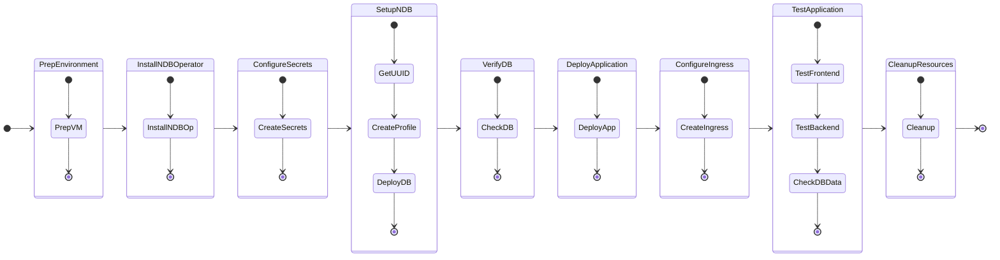

# Getting Started

In this part of the lab we will deploy a workload on NKP cluster which stores its database in a NDB deployed Postgres server.

We will also deploy a Kubernetes cluster so far as per the NVD [design requirements](../conceptual/conceptual.md#management-kubernetes-cluster).

Deploy the NKP kubernetes cluster with the following components:

- 3 x Control plane nodes
- 3 x Worker nodes

The following is the flow of the NAI lab:

