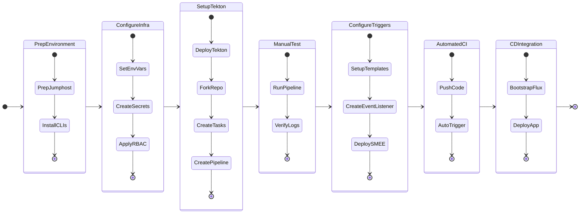

## **Introduction**

This lab is designed to guide you through the construction of a complete **GitOps-driven CI/CD pipeline** on the Nutanix Kubernetes Platform (NKP). These documents provide a step-by-step roadmap for setting up a modern software delivery lifecycle, starting from initial environment preparation to automated container builds.

### **Lab Objectives**

By following these modules, you will establish a robust **Continuous Integration (CI)** framework. Currently, the labs cover:

  * **Environment Preparation:** Setting up the necessary prerequisites, including an NKP workload cluster and the installation of essential tools like the **Tekton** and **Flux** CLI clients.
  * **Infrastructure Configuration:** Configuring secrets, ServiceAccounts, and RBAC to allow your CI tools to interact securely with your cluster and image registries.
  * **Pipeline Development:** Building **Tekton Pipelines** that utilize **Kaniko** to compile "Hello World" containers and push them to a private **Harbor** registry or public **Docker** registry.
  * **Automation:** Implementing **Tekton Triggers** and the **SMEE client** to allow your cluster to receive GitHub webhooks, ensuring your pipeline fires automatically on every code push.

### **Current Status and Future CD Integration**
The existing documentation focuses heavily on the **Continuous Integration (CI)** phase using Tekton. You will begin by manually testing your pipelines before moving to full automation. 

As you noted, the **Continuous Deployment (CD)** portion of this lab—which will utilize **Flux v2**—is the final piece of the architecture. Once that section is built and integrated, Flux will be bootstrapped against your GitHub repository to manage the automated deployment of your application manifests, completing the full GitOps loop.

### **Getting Started**
Before proceeding to the CI setup, ensure your jumphost VM and NKP cluster meet the minimum requirements, such as having the appropriate vCPU, memory, and storage allocations defined in the prerequisites. Once your tools are installed and your environment is sourced, you will be ready to build your first Tekton objects.

By the end you will have:

 * Tekton Pipelines + Triggers installed, with the Dashboard exposed over HTTPS via Ingress
 * Flux v2 bootstrapped against your personal GitHub fork, managing both Tekton manifests and the application deployment
 * A Kaniko build task that compiles a Hello World container and pushes it to your private Harbor project
 * A GitHub webhook that fires the pipeline automatically on every push to main using SMEE client

## **Lab Flow**

