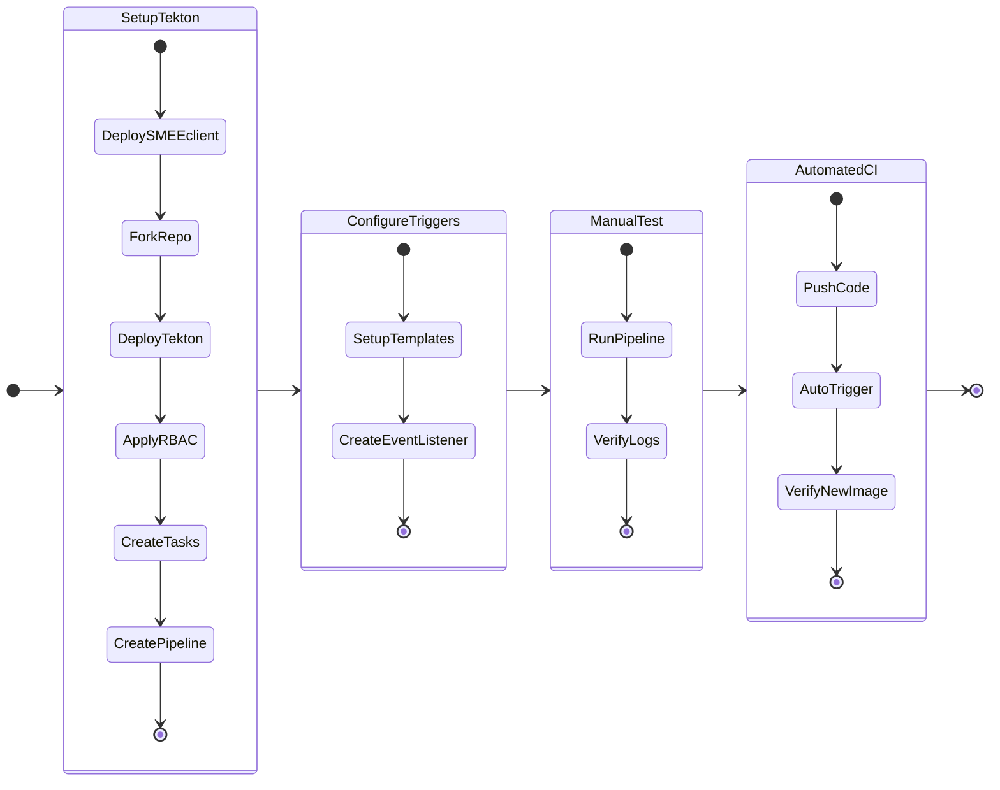

## Introduction - Continuous Integration

This section walks you through building the Continuous Integration setup using Tekton pipelines. 




## CI Setup

### Configure SMEE Client

Since our ``nkpcicd`` cluster is hosted in a private network, we need [SMEE client](https://smee.io/) to be able to send webhooks to our Tekton ``EventListener``.

!!! warning
    
    SMEE is just an example webhook transport facilitator. This should never be used in Production environments. It is mainly designed for development environments.

    SMEE Deployment should be only run is least privileges as documented here

    NKP Gateway will prevent any pod with latest tag from running inside the container.

!!! info  "From SMEE.io"
    
    *If your application needs to respond to webhooks, you'll need some way to expose localhost to the internet. smee.io is a small service that uses Server-Sent Events to proxy payloads from the webhook source, then transmit them to your locally running application.*

!!! tip title "SMEE Workflow"

    This is order in which the Github webhook will announce changes in the Github repository to Tekton running inside ``nkpcicd`` cluster which runs in a private network.

    1. Configure Webhook in the Github's application's repository
    2. Application developer pushes changes to github repository
    3. Webhook from SMEE.io gets triggered
    4. SMEE workload (running as a ``Deployment`` in the ``nkpcicd`` cluster) listens for changes to git repository
    5. SMEE ``Deployment`` calls Tekton's ``EventListener``
    6. EventListener calls ``Triggers`` which refer to the ``TriggerTemplate`` to run ``Pipeline``


1. Go to [SMEE client](https://smee.io/) webpage 
2. Click on **Start a new channel** and get a listener URL.
3. Open ``$HOME/cicd/.env`` file in VSC and add (append) the following environment variables to your ``.env`` file and save
   
    
    === ":octicons-file-code-16: Template ``.env``"

        ```bash hl_lines="9"
        export REGISTRY_URL=_your_registry_url
        export REGISTRY_USERNAME=_your_registry_username
        export REGISTRY_PASSWORD=_your_registry_password
        export REGISTRY_CACERT=_path_to_ca_cert_of_registry  # (1)!
        # Optional if using Docker - Public Docker Registry Details
        export DOCKER_REGISTRY_URL=_your_registry_url
        export DOCKER_REGISTRY_USERNAME=_your_registry_username
        export DOCKER_REGISTRY_PASSWORD=_your_registry_password
        export SMEE_URL=_your_smee_url
        ```

        1. File must contain CA server and Harbor server's public certificate in one file

    === ":octicons-file-code-16: Sample ``.env``"

        ```bash hl_lines="9"
        export REGISTRY_URL=https://harbor.10.x.x.111.nip.io/nkp
        export REGISTRY_USERNAME=admin
        export REGISTRY_PASSWORD=xxxxxxxx
        export REGISTRY_CACERT=$HOME/harbor/certs/full_chain.pem  # (1)!
        # Optional if using Docker - Public Docker Registry Details
        export DOCKER_REGISTRY_URL=https://index.docker.io/v1/
        export DOCKER_REGISTRY_USERNAME=dockeruser
        export DOCKER_REGISTRY_PASSWORD=_XXXXXXXXXX
        export SMEE_URL=https://smee.io/pPxxxxxxxxxxxxxxxd
        ```

        2. File must contain CA server and Harbor server's public certificate in one file

4. Source the new variables and values to the environment
   
    === ":octicons-command-palette-16: Command"
    
        ```bash
        cd $HOME/cicd/
        source .env
        ```
5. Crete a ``Secret`` that the SMEE Deployment can use
   
    === ":octicons-command-palette-16: Command"
    
        ```bash
        kubectl create secret generic smee-config \
        -n default \
        --from-literal=channel-url="${SMEE_URL}" \
        --dry-run=client -o yaml | kubectl apply -f -
        ```

    === ":octicons-command-palette-16: Command output"
    
        ```bash
        secret/smee-config created
        ```

6. Create the SMEE deployment so we can listen for changes to git repository. Note the securityContext in the ``Deployment``

    ```yaml hl_lines="25 36-44"
    kubectl apply -f -<<EOF
    apiVersion: apps/v1
    kind: Deployment
    metadata:
      name: smee-client
      namespace: default
    spec:
      replicas: 1
      selector:
        matchLabels:
          app: smee-client
      template:
        metadata:
          labels:
            app: smee-client
        spec:
          containers:
          - name: smee-client
            image: "amplifysecurity/smee-client"
            # Move these out of securityContext
            args:
              - --url
              - "${SMEE_URL}"
              - --target
              - "http://el-github-listener.default.svc.cluster.local:8080" # (1)!
            env:
              - name: ${SMEE_URL}"
                valueFrom:
                  secretKeyRef:
                    name: smee-config
                    key: channel-url
            resources:
              requests: {cpu: 50m, memory: 64Mi}
              limits: {cpu: 100m, memory: 128Mi}
            # securityContext should only contain security-specific flags
            securityContext:
              allowPrivilegeEscalation: false
              capabilities:
                drop:
                  - ALL
              runAsNonRoot: true
              runAsUser: 1000
              seccompProfile:
                type: RuntimeDefault
    EOF
    ```

    1. SMEE client will communicate with the Tekton ``EventListener`` which we will create. 

7. Wait for the SMEE client to start and check for **Connected** message in the logs
   
    === ":octicons-command-palette-16: Command"
    
        ```bash
        kubectl get pods -n default -l app=smee-client
        kubectl logs -n default -l app=smee-client
        ```

    === ":octicons-command-palette-16: Command output"
    
        ```bash hl_lines="8"
        $ kubectl get pods -n default -l app=smee-client
        NAME                          READY   STATUS    RESTARTS   AGE
        smee-client-5b46d4646-rdfkb   1/1     Running   0          15s
        #
        $ kubectl logs -n default -l app=smee-client
        #
        Forwarding https://smee.io/pPxxxxxxxxxxxxxxxd to http://el-app-source-listener.default.svc.cluster.local:8080
        Connected https://smee.io/pPxxxxxxxxxxxxxxxd
        ```

### Setup Github Repo

1. We will create Tekton objects in the NKP cluster using manifests files
2. Open [Github](https://www.github.com) in a browser
3. Login with you Github account
4. Open this repository URL on a different browser tab
   
    !!! info 
    
        This repository hosts the manifests of two functions:
        
         *  The sample application's source code
         *  The tekton objects that we will create to enable CI

    === ":material-link: Git URL"
    
        ```bash
        https://github.com/ariesbabu/app-source.git
        ```

5. **Fork** the following repo to your GitHub account
   
6. After the fork, there will be copy of the source repo in your github handle
   
    === ":material-link: Git URL"
     
         ```bash
         https://github.com/_your_git_handle/app-source.git
         ```
    
    === ":material-link: Example Git URL"
     
         ```bash
         https://github.com/student1/app-source.git
         ```

7. Go to **Settings** page of the cloned ``_your_git_handle/app-source`` repository
8. Select **Webhooks**
9. Click on **Add webhook**
10. Populate deatails:
    
     - **Payload URL** - paste the SMEE listening URL from previous [Configure SMEE Client](#configure-smee-client) (e.g `https://smee.io/pPxxxxxxxxxxxxxxxd`)
     - **Content type** - **application/json**
     - **Enable SSL vertification** - selected
     - **Which events would you like to trigger this webhook** - Send me everything
     - **Active** - selected
  
11. Click on **Add Webhook** button

12. Open a Terminal in ``VSCode`` > ``Terminal`` and set your github config

    === ":octicons-command-palette-16: Command"

        ```bash
        git config --user.email "_your_github_email"
        git config --user.name "_your_github_username"
        ```

13. Login to your Github account using the following command:

    === ":octicons-command-palette-16: Command"

        ```bash
        gh auth login # (1)
        ```

        1.  :material-fountain-pen-tip:  If you do not have ``gh`` client installed, see [Github CLI Installation Docs](https://github.com/cli/cli/blob/trunk/docs/install_linux.md).
            
            ```bash title="Ubuntu installation"
            sudo apt update
            sudo apt install gh
            ```
   
    === ":octicons-command-palette-16: Command Execution Example"

        ```{ .text, .no-copy }
        # Execution example
    
        ❯ gh auth login                                                                                                               ─╯
        ? What account do you want to log into? GitHub.com
        ? What is your preferred protocol for Git operations on this host? HTTPS 
        ? Authenticate Git with your GitHub credentials? Yes
        ? How would you like to authenticate GitHub CLI?  [Use arrows to move, type to filter]
            Login with a web browser
        >   Paste an authentication token
    
        Successfully logged in to Github.
        ```
    

7. Git clone the forked git repo to get a local copy on the jumphost VM
   
    === ":octicons-command-palette-16: Command"
    
        ```bash
        cd $HOME/cicd/
        git clone https://github.com/_your_github_handle/app-source.git
        ```
    
    === ":octicons-command-palette-16: Sample command"
    
        ```bash
        cd $HOME/cicd/
        git clone https://github.com/student1/app-source.git
        ```
    
    === ":octicons-command-palette-16: Command output"
    
        ```bash
        Cloning into 'app-source'...
        remote: Enumerating objects: 234, done.
        remote: Counting objects: 100% (47/47), done.
        remote: Compressing objects: 100% (34/34), done.
        remote: Total 234 (delta 21), reused 36 (delta 13), pack-reused 187 (from 1)
        Receiving objects: 100% (234/234), 28.75 KiB | 892.00 KiB/s, done.
        Resolving deltas: 100% (145/145), done.
        ```

### Install Tekton

1. Login to the ``nkpcicd`` workload kubernetes server and ensure you are using the right context before proceeding
   
    === ":octicons-command-palette-16: Command"
    
        ```bash
        export KUBECONFIG=nkpcicd.conf
        kubectl get nodes  # (1)!
        ```

        1. Run any kubectl command to ensure your are in the correct context (workload cluster ``nkpcicd``)
    
    === ":octicons-command-palette-16: Command output"
    
        ```bash
        $ kubectl get nodes
        #
        NAME                                STATUS   ROLES           AGE    VERSION
        nkpcicd-lkr26-lc56p                 Ready    control-plane   5d3h   v1.34.3
        nkpcicd-md-0-4jkvk-mcp9r-bbjvq      Ready    <none>          5d3h   v1.34.3
        nkpcicd-md-0-4jkvk-mcp9r-phlv7      Ready    <none>          5d3h   v1.34.3
        ```

2. Install Tekton Components

    === ":octicons-command-palette-16: Command"
    
        ```bash
        # Install Tekton Pipelines
        kubectl apply -f https://storage.googleapis.com/tekton-releases/pipeline/latest/release.yaml
        ```
        ```bash
        # Install Tekton Triggers
        kubectl apply -f https://storage.googleapis.com/tekton-releases/triggers/latest/release.yaml
        ```
        ```bash
        # Install Tekton Interceptors
        kubectl apply -f https://storage.googleapis.com/tekton-releases/triggers/latest/interceptors.yaml
        ```
        ```bash
        # Verify the installation and wait for the pods to be up and running
        kubectl get pods -n tekton-pipelines -w
        ```
 
    === ":octicons-command-palette-16: Command output"
    
        ```{ .text .no-copy }
        $ kubectl get pods -n tekton-pipelines 
        #
        NAME                                                 READY   STATUS    RESTARTS   AGE
        tekton-events-controller-5cbc777ccd-flc57            1/1     Running   0          57s
        tekton-pipelines-controller-65f567589b-lhkgp         1/1     Running   0          58s
        tekton-pipelines-webhook-75cd84877-pbzsx             1/1     Running   0          57s
        tekton-triggers-controller-66fd74568d-c7jpl          1/1     Running   0          53s
        tekton-triggers-core-interceptors-66456f8cf6-nsd5q   1/1     Running   0          48s
        tekton-triggers-webhook-55c8dd895f-9bz68             1/1     Running   0          53s
        ```

### Create Tekton Objects


8. Create RBAC using ``Role``, ``RoleBinding``, ``ClusterRole`` and ``ClusterRoleBinding`` kubernetes objects for Tekton
   
    === ":octicons-command-palette-16: Command"
    
        ```yaml
        cd $HOME/cicd/
        kubectl apply -f app-source/tekton/rbac.yaml
        ```
    
    === ":octicons-command-palette-16: Command output"
    
        ```{ .text .no-copy }
        role.rbac.authorization.k8s.io/tekton-triggers-full-access unchanged
        rolebinding.rbac.authorization.k8s.io/tekton-build-sa-eventlistener-binding unchanged
        clusterrole.rbac.authorization.k8s.io/tekton-triggers-cluster-viewer unchanged
        clusterrolebinding.rbac.authorization.k8s.io/tekton-build-sa-cluster-interceptor-binding unchanged
        role.rbac.authorization.k8s.io/tekton-triggers-admin-role unchanged
        rolebinding.rbac.authorization.k8s.io/tekton-triggers-admin-binding unchanged
        ```

9.  Create Tekton ``Tasks``. ``Tasks`` are invidual actions that can defined seperately and assembeled together in a ``PipeLine``.

    * Git clone task
    * Container Build and push task
    
    === ":octicons-command-palette-16: Command"
    
        ```bash
        kubectl apply -f app-source/tekton/tasks/git-clone.yaml
        kubectl apply -f app-source/tekton/tasks/kaniko-build.yaml
        ```
 
    === ":octicons-command-palette-16: Command output"
    
        ```bash
        task.tekton.dev/git-clone created
        task.tekton.dev/kaniko-build created
        ```

10. Create the Tekton ``Pipeline`` object. This will stitch the two tasks we need to execute in order
    
    === ":octicons-command-palette-16: Command"
    
        ```bash
        kubectl apply -f app-source/tekton/pipeline.yaml
        ```
 
    === ":octicons-command-palette-16: Command output"
    
        ```bash
        pipeline.tekton.dev/build-and-push-pipeline created
        ```

11. Edit the ``TriggerTemplate`` manifest from here and open it VSCode
   
    === ":octicons-command-palette-16: Command"
     
         ```bash
         code app-source/tekton/triggers/trigger-template.yaml
         # You can also use vim
         # vim app-source/tekton/triggers/trigger-template.yaml
         ```
     
12. Change the ``image`` value field to represent your Docker or Harbor registry
    
    === ":octicons-file-code-16: Template ``trigger-template.yaml``"
    
        ```yaml hl_lines="27"
        apiVersion: triggers.tekton.dev/v1beta1
        kind: TriggerTemplate
        metadata:
        name: build-trigger-template
        namespace: default
        spec:
        params:
            - name: git-revision
            description: The Git revision
            - name: git-url
            description: The Git repository URL
        resourcetemplates:
            - apiVersion: tekton.dev/v1
            kind: PipelineRun
            metadata:
                generateName: build-triggered-
            spec:
                pipelineRef:
                name: build-and-push-pipeline
                serviceAccountName: tekton-build-sa
                params:
                - name: git-url
                    value: $(tt.params.git-url)
                - name: git-revision
                    value: $(tt.params.git-revision)
                - name: image
                    value: "docker.io/_your_git_handle/app-source"
                workspaces:
                - name: shared-workspace
                    volumeClaimTemplate:
                    spec:
                        accessModes:
                        - ReadWriteOnce
                        resources:
                        requests:
                            storage: 1Gi
        ```
    
    === ":octicons-file-code-16: Harbor Reg Sample ``trigger-template.yaml`"
    
        ```yaml hl_lines="27"
        apiVersion: triggers.tekton.dev/v1beta1
        kind: TriggerTemplate
        metadata:
        name: build-trigger-template
        namespace: default
        spec:
        params:
            - name: git-revision
            description: The Git revision
            - name: git-url
            description: The Git repository URL
        resourcetemplates:
            - apiVersion: tekton.dev/v1
            kind: PipelineRun
            metadata:
                generateName: build-triggered-
            spec:
                pipelineRef:
                name: build-and-push-pipeline
                serviceAccountName: tekton-build-sa
                params:
                - name: git-url
                    value: $(tt.params.git-url)
                - name: git-revision
                    value: $(tt.params.git-revision)
                - name: image
                    value: "harbor.10.x.x.134.nip.io/student1/app-source"
                workspaces:
                - name: shared-workspace
                    volumeClaimTemplate:
                    spec:
                        accessModes:
                        - ReadWriteOnce
                        resources:
                        requests:
                            storage: 1Gi
        ```

    === ":octicons-file-code-16: Docker Reg Sample ``trigger-template.yaml`"
    
        ```yaml hl_lines="27"
        apiVersion: triggers.tekton.dev/v1beta1
        kind: TriggerTemplate
        metadata:
        name: build-trigger-template
        namespace: default
        spec:
        params:
            - name: git-revision
            description: The Git revision
            - name: git-url
            description: The Git repository URL
        resourcetemplates:
            - apiVersion: tekton.dev/v1
            kind: PipelineRun
            metadata:
                generateName: build-triggered-
            spec:
                pipelineRef:
                name: build-and-push-pipeline
                serviceAccountName: tekton-build-sa
                params:
                - name: git-url
                    value: $(tt.params.git-url)
                - name: git-revision
                    value: $(tt.params.git-revision)
                - name: image
                    value: "docker.io/student1/app-source"
                workspaces:
                - name: shared-workspace
                    volumeClaimTemplate:
                    spec:
                        accessModes:
                        - ReadWriteOnce
                        resources:
                        requests:
                            storage: 1Gi
        ```
    
     

13. Create the ``TriggerTemplate`` to get the ``git_ur``l and ``git_revision`` from a github push event
   
    === ":octicons-command-palette-16: Command"
    
        ```bash
        kubectl apply -f app-source/tekton/triggers/trigger-template.yaml
        ```
    
    === ":octicons-command-palette-16: Command output"
    
        ```bash
        triggertemplate.triggers.tekton.dev/build-trigger-template created
        ```

14. Create the ``TriggerBinding`` which supplies values for ``git_url`` and ``git_revision`` at that point in time
   
    === ":octicons-command-palette-16: Command"
    
        ```bash
        kubectl apply -f app-source/tekton/triggers/trigger-binding.yaml
        ```
    
    === ":octicons-command-palette-16: Command output"
    
        ```bash
        triggerbinding.triggers.tekton.dev/github-push-binding created
        ```

15. Create the github ``EventListener`` which listens for ``git push`` events
    
    === ":octicons-command-palette-16: Command"
    
        ```bash
        kubectl apply -f app-source/tekton/triggers/event-listener.yaml
        ```
    
    === ":octicons-command-palette-16: Command output"
    
        ```bash
        eventlistener.triggers.tekton.dev/github-listener created
        ```
    
    ??? warning "What is the state of EventListener"
        
        ``EventListener`` will be running however it will not be able to listen to WebHooks, as there is no route for github webhook to reach the ``EventListener`` running inside our private network NKP cluster ``nkpcicd``.

        === ":octicons-command-palette-16: Command"
    
            ```bash
            kubectl get po -n default
            ```
        === ":octicons-command-palette-16: Command"
    
            ```{ .text .no-copy }
            kubectl get po
            NAME                                  READY   STATUS    RESTARTS   AGE
            el-github-listener-7fdf59cc74-lv9rn   1/1     Running   0          15s
            ```
    
        We will configure SMEE client in the next section which will facilitate the Webhook communication from public Github in the next section.

        ---
 
        **For the curious:**
      
        **Example Production Setup for EventListener to listen on HTTPS**

        To listen via an Ingress instead of using the SMEE client, you must create two objects: the `EventListener` itself and an `Ingress` resource that routes traffic to the service generated by that listener.
        
        **1. EventListener Manifest**
        This object creates a service (typically named `el-<listener-name>`) that waits for JSON payloads from GitHub. This example uses the **ServiceAccount** mentioned in the pre-requisites.
        
        ```yaml
        apiVersion: triggers.tekton.dev/v1beta1
        kind: EventListener
        metadata:
          name: github-listener
        spec:
          serviceAccountName: tekton-build-sa # As configured in Source
          triggers:
           - name: github-push
             interceptors:
               - ref:
                   name: "github"
                 params:
                   - name: "eventTypes"
                     value: ["push"]
            - binding:
                name: github-binding # Reference to object in Source
              template:
                name: github-template # Reference to object in Source
        ```
        
        **2. Ingress Manifest**
        Because the sources mention using Ingress for the Dashboard over HTTPS, a similar manifest is required to expose the `EventListener`. This routes external traffic from a public URL directly to the listener's service.
        
        ```yaml
        apiVersion: networking.k8s.io/v1
        kind: Ingress
        metadata:
          name: el-ingress
          annotations:
            kubernetes.io/ingress.class: nginx
        spec:
          rules:
          - host: webhook.your-domain.com # Use your specific STUDENT_ID domain
            http:
              paths:
              - path: /
                pathType: Prefix
                backend:
                  service:
                    name: el-github-listener # Matches el-<metadata.name> of listener
                    port:
                      number: 8080
        ```
        
        **Configuration Notes**

         * **Service Mapping:** When you apply an `EventListener` named `github-listener`, Tekton automatically creates a Kubernetes Service named `el-github-listener` on port `8080`. Your Ingress must point to this specific service name.
         * **Security:** The sources emphasize that the current lab environment is in a **private network**, which is why the **SMEE client** is used to tunnel webhooks from the public internet to your private listener.
         * **GitHub Setup:** If you use this Ingress approach, you would bypass the SMEE listener URL and instead enter your Ingress host URL (e.g., `https://webhook.your-domain.com`) directly into the GitHub Webhook settings.
        
        ***
        
        **Disclaimer:** The specific YAML manifests above are illustrative examples constructed based on the names and components described here (such as `TriggerTemplate`, `TriggerBinding`, and `tekton-sa`); the exact code blocks for these objects are not explicitly provided.


### Manual - Pipeline Run

As we have created the ``Pipeline`` consisting of our ``git-clone`` and ``kaniko-build`` ``Tasks``. We are able to test a ``PipelineRun``. It is essential to make sure our ``PipeLine`` is working before continuing to automate it. 

1. Create the Tekton manual ``PipelineRun`` object. This will stitch the two tasks we need to execute in order and execute them. 
    
    === ":octicons-command-palette-16: Command"
    
        ```bash
        kubectl create -f app-source/tekton/pipeline-run.yaml
        ```
 
    === ":octicons-command-palette-16: Command output"
    
        ```bash
        ```

2. Observe the logs using ``tkn`` command
   
    === ":octicons-command-palette-16: Command"
    
        ```bash
        tkn pipelinerun logs --last -f 
        ```
    
    
    === ":octicons-command-palette-16: Command output"
    
        ```text hl_lines="5-6 60-61"
        tkn pipelinerun logs -f --last
        [clone-repo : clone] Cloning into '/workspace/output/source'...
        [clone-repo : clone] Note: switching to '47e93d64cf9f788c00dfad0b8b27b79afffa4b88'.

        [clone-repo : clone] HEAD is now at 47e93d6 Add: adding tekton files
        [clone-repo : clone] Cloned https://github.com/_your_github_handle/app-source.git at 47e93d6
    
        [build-image : build-and-push] INFO[0000] Retrieving image manifest python:3.12-slim   
        [build-image : build-and-push] INFO[0000] Retrieving image python:3.12-slim from registry index.docker.io 
        [build-image : build-and-push] INFO[0001] Retrieving image manifest python:3.12-slim   
        [build-image : build-and-push] INFO[0001] Returning cached image manifest              
        [build-image : build-and-push] INFO[0001] Built cross stage deps: map[]                
        [build-image : build-and-push] INFO[0001] Retrieving image manifest python:3.12-slim   
        [build-image : build-and-push] INFO[0001] Returning cached image manifest              
        [build-image : build-and-push] INFO[0001] Retrieving image manifest python:3.12-slim   
        [build-image : build-and-push] INFO[0001] Returning cached image manifest              
        [build-image : build-and-push] INFO[0001] Executing 0 build triggers                   
        [build-image : build-and-push] INFO[0001] Building stage 'python:3.12-slim' [idx: '0', base-idx: '-1'] 
        [build-image : build-and-push] INFO[0001] Checking for cached layer docker.io/_your_github_handle/app-source-cache:1e866e51d8b7c36f12c9de5a05920a7c9ba9213dcb0f6515a6f10e1ab82cbce4... 
        [build-image : build-and-push] INFO[0002] Using caching version of cmd: RUN useradd -u 1001 -m appuser 
        [build-image : build-and-push] INFO[0002] Checking for cached layer docker.io/_your_github_handle/app-source-cache:03666d67cb2e99a403af6ad31962c4787a1f197c53e33d087e12727b405a8a20... 
        [build-image : build-and-push] INFO[0002] Using caching version of cmd: RUN pip install --no-cache-dir -r requirements.txt 
        [build-image : build-and-push] INFO[0002] Cmd: USER                                    
        [build-image : build-and-push] INFO[0002] Cmd: EXPOSE                                  
        [build-image : build-and-push] INFO[0002] Adding exposed port: 8000/tcp                
        [build-image : build-and-push] INFO[0002] Unpacking rootfs as cmd COPY requirements.txt . requires it. 
        [build-image : build-and-push] INFO[0004] ARG APP_VERSION=dev                          
        [build-image : build-and-push] INFO[0004] No files changed in this command, skipping snapshotting. 
        [build-image : build-and-push] INFO[0004] ARG GIT_SHA=dev                              
        [build-image : build-and-push] INFO[0004] No files changed in this command, skipping snapshotting. 
        [build-image : build-and-push] INFO[0004] ARG BUILD_TIME=dev                           
        [build-image : build-and-push] INFO[0004] No files changed in this command, skipping snapshotting. 
        [build-image : build-and-push] INFO[0004] ENV APP_VERSION=${APP_VERSION} GIT_SHA=${GIT_SHA} BUILD_TIME=${BUILD_TIME} 
        [build-image : build-and-push] INFO[0004] No files changed in this command, skipping snapshotting. 
        [build-image : build-and-push] INFO[0004] RUN useradd -u 1001 -m appuser               
        [build-image : build-and-push] INFO[0004] Found cached layer, extracting to filesystem 
        [build-image : build-and-push] INFO[0005] WORKDIR /app                                 
        [build-image : build-and-push] INFO[0005] Cmd: workdir                                 
        [build-image : build-and-push] INFO[0005] Changed working directory to /app            
        [build-image : build-and-push] INFO[0005] Creating directory /app with uid -1 and gid -1 
        [build-image : build-and-push] INFO[0005] Taking snapshot of files...                  
        [build-image : build-and-push] INFO[0005] COPY requirements.txt .                      
        [build-image : build-and-push] INFO[0005] Taking snapshot of files...                  
        [build-image : build-and-push] INFO[0005] RUN pip install --no-cache-dir -r requirements.txt 
        [build-image : build-and-push] INFO[0005] Found cached layer, extracting to filesystem 
        [build-image : build-and-push] INFO[0007] COPY app.py .                                
        [build-image : build-and-push] INFO[0007] Taking snapshot of files...                  
        [build-image : build-and-push] INFO[0007] USER appuser                                 
        [build-image : build-and-push] INFO[0007] Cmd: USER                                    
        [build-image : build-and-push] INFO[0007] No files changed in this command, skipping snapshotting. 
        [build-image : build-and-push] INFO[0007] EXPOSE 8000                                  
        [build-image : build-and-push] INFO[0007] Cmd: EXPOSE                                  
        [build-image : build-and-push] INFO[0007] Adding exposed port: 8000/tcp                
        [build-image : build-and-push] INFO[0007] No files changed in this command, skipping snapshotting. 
        [build-image : build-and-push] INFO[0007] CMD ["uvicorn", "app:app", "--host", "0.0.0.0", "--port", "8000"] 
        [build-image : build-and-push] INFO[0007] No files changed in this command, skipping snapshotting. 
        [build-image : build-and-push] INFO[0007] Pushing image to docker.io/_your_github_handle/app-source:47e93d6 
        [build-image : build-and-push] INFO[0010] Pushed index.docker.io/_your_github_handle/app-source@sha256:ef8671bb7454711023109926ba29658e3fdac34f619168432f22f6974add7b2e 

        [build-image : build-and-push] INFO[0010] Pushing image to docker.io/_your_github_handle/app-source:latest 
        [build-image : build-and-push] INFO[0012] Pushed index.docker.io/_your_github_handle/app-source@sha256:ef8671bb7454711023109926ba29658e3fdac34f619168432f22f6974add7b2e 
        ```

3. Confirm new image in **Docker** or **Harbor** registry that was chosen during initial Secret and ServiceAccount configuration in the [Pre-requisites section](../nkp_cicd_lab/nkp_cicd_prereq.md#configure-secrets-sa-and-rbac).
   
4. Explore the details of the image around the image tag

### Automated - Pipeline Run

In this section we will configure automation of Tekton PipelineRuns so it triggers as it detects every push to git repository.

1. Create a small change to the application source code and push to git hub
   
    === ":octicons-command-palette-16: Command"
    
        ```bash
        cd $HOME/cicd/app-source/
        echo "# Testing first automated PipelineRun" >> app.py
        git add .
        git commit -am "Chore: Testing first automated PipelineRun"
        git push
        cd ..
        ```
    
    === ":octicons-command-palette-16: Command output"
    
        ```{ .text .no-copy }
        $ echo "# Testing first automated PipelineRun" >> app.py

        $ git add .

        $ git commit -am "Chore: Testing first automated PipelineRun"

        $ git push
        #
        [main 3338bbe] Chore: Testing first automated PipelineRun
        1 file changed, 1 insertion(+)
        Enumerating objects: 5, done.
        Counting objects: 100% (5/5), done.
        Delta compression using up to 12 threads
        Compressing objects: 100% (3/3), done.
        Writing objects: 100% (3/3), 343 bytes | 343.00 KiB/s, done.
        Total 3 (delta 2), reused 0 (delta 0), pack-reused 0
        remote: Resolving deltas: 100% (2/2), completed with 2 local objects.
        To https://github.com/_your_git_handle/app-source.git
        47e93d6..3338bbe  main -> main
        ```

2. Check SMEE logs to see if the Webhook from Github has been pushed to ``EventListener``
   
    === ":octicons-command-palette-16: Command"
    
        ```bash
        kubectl logs -n default -l app=smee-client
        ```

    === ":octicons-command-palette-16: Command output"
    
        ```bash hl_lines="5"
        $ kubectl logs -n default -l app=smee-client
        #
        Forwarding https://smee.io/pPxxxxxxxxxxxxxxxd to http://el-app-source-listener.default.svc.cluster.local:8080
        Connected https://smee.io/pPxxxxxxxxxxxxxxxd
        POST http://el-github-listener.default.svc.cluster.local:8080/ - 202
        ```

3. Observe the ``PipelineRun`` logs using ``tkn`` command
   
    === ":octicons-command-palette-16: Command"
    
        ```bash
        tkn pipelinerun list 
        tkn pipelinerun logs --last -f 
        ```
    
    
    === ":octicons-command-palette-16: Command output"
    
        ```text hl_lines="12-13 67-68"
        $ tkn pipelinerun list 
        #
        NAME                       STARTED         DURATION   STATUS
        build-triggered-5cft4      3 minutes ago   26s        Succeeded
        build-triggered-b5lgd      10 minutes ago  25s        Succeeded
        
        $ tkn pipelinerun logs -f --last
        #
        [clone-repo : clone] Cloning into '/workspace/output/source'...
        [clone-repo : clone] Note: switching to '3338bbe89277ea313014a258dec06bff60f2d3b8'.
        [clone-repo : clone] HEAD is now at 3338bbe Chore: Testing first automated PipelineRun
        # Successful clone
        [clone-repo : clone] Cloned https://github.com/_your_github_handle/app-source.git at 3338bbe

        [build-image : build-and-push] INFO[0000] Retrieving image manifest python:3.12-slim   
        [build-image : build-and-push] INFO[0000] Retrieving image python:3.12-slim from registry index.docker.io 
        [build-image : build-and-push] INFO[0001] Retrieving image manifest python:3.12-slim   
        [build-image : build-and-push] INFO[0001] Returning cached image manifest              
        [build-image : build-and-push] INFO[0001] Built cross stage deps: map[]                
        [build-image : build-and-push] INFO[0001] Retrieving image manifest python:3.12-slim   
        [build-image : build-and-push] INFO[0001] Returning cached image manifest              
        [build-image : build-and-push] INFO[0001] Retrieving image manifest python:3.12-slim   
        [build-image : build-and-push] INFO[0001] Returning cached image manifest              
        [build-image : build-and-push] INFO[0001] Executing 0 build triggers                   
        [build-image : build-and-push] INFO[0001] Building stage 'python:3.12-slim' [idx: '0', base-idx: '-1'] 
        [build-image : build-and-push] INFO[0001] Checking for cached layer docker.io/_your_github_handle/app-source-cache:1e866e51d8b7c36f12c9de5a05920a7c9ba9213dcb0f6515a6f10e1ab82cbce4... 
        [build-image : build-and-push] INFO[0002] Using caching version of cmd: RUN useradd -u 1001 -m appuser 
        [build-image : build-and-push] INFO[0002] Checking for cached layer docker.io/_your_github_handle/app-source-cache:03666d67cb2e99a403af6ad31962c4787a1f197c53e33d087e12727b405a8a20... 
        [build-image : build-and-push] INFO[0002] Using caching version of cmd: RUN pip install --no-cache-dir -r requirements.txt 
        [build-image : build-and-push] INFO[0002] Cmd: USER                                    
        [build-image : build-and-push] INFO[0002] Cmd: EXPOSE                                  
        [build-image : build-and-push] INFO[0002] Adding exposed port: 8000/tcp                
        [build-image : build-and-push] INFO[0002] Unpacking rootfs as cmd COPY requirements.txt . requires it. 
        [build-image : build-and-push] INFO[0004] ARG APP_VERSION=dev                          
        [build-image : build-and-push] INFO[0004] No files changed in this command, skipping snapshotting. 
        [build-image : build-and-push] INFO[0004] ARG GIT_SHA=dev                              
        [build-image : build-and-push] INFO[0004] No files changed in this command, skipping snapshotting. 
        [build-image : build-and-push] INFO[0004] ARG BUILD_TIME=dev                           
        [build-image : build-and-push] INFO[0004] No files changed in this command, skipping snapshotting. 
        [build-image : build-and-push] INFO[0004] ENV APP_VERSION=${APP_VERSION} GIT_SHA=${GIT_SHA} BUILD_TIME=${BUILD_TIME} 
        [build-image : build-and-push] INFO[0004] No files changed in this command, skipping snapshotting. 
        [build-image : build-and-push] INFO[0004] RUN useradd -u 1001 -m appuser               
        [build-image : build-and-push] INFO[0004] Found cached layer, extracting to filesystem 
        [build-image : build-and-push] INFO[0005] WORKDIR /app                                 
        [build-image : build-and-push] INFO[0005] Cmd: workdir                                 
        [build-image : build-and-push] INFO[0005] Changed working directory to /app            
        [build-image : build-and-push] INFO[0005] Creating directory /app with uid -1 and gid -1 
        [build-image : build-and-push] INFO[0005] Taking snapshot of files...                  
        [build-image : build-and-push] INFO[0005] COPY requirements.txt .                      
        [build-image : build-and-push] INFO[0005] Taking snapshot of files...                  
        [build-image : build-and-push] INFO[0005] RUN pip install --no-cache-dir -r requirements.txt 
        [build-image : build-and-push] INFO[0005] Found cached layer, extracting to filesystem 
        [build-image : build-and-push] INFO[0007] COPY app.py .                                
        [build-image : build-and-push] INFO[0007] Taking snapshot of files...                  
        [build-image : build-and-push] INFO[0007] USER appuser                                 
        [build-image : build-and-push] INFO[0007] Cmd: USER                                    
        [build-image : build-and-push] INFO[0007] No files changed in this command, skipping snapshotting. 
        [build-image : build-and-push] INFO[0007] EXPOSE 8000                                  
        [build-image : build-and-push] INFO[0007] Cmd: EXPOSE                                  
        [build-image : build-and-push] INFO[0007] Adding exposed port: 8000/tcp                
        [build-image : build-and-push] INFO[0007] No files changed in this command, skipping snapshotting. 
        [build-image : build-and-push] INFO[0007] CMD ["uvicorn", "app:app", "--host", "0.0.0.0", "--port", "8000"] 
        [build-image : build-and-push] INFO[0007] No files changed in this command, skipping snapshotting. 
        [build-image : build-and-push] INFO[0007] Pushing image to docker.io/_your_github_handle/app-source:3338bbe 
        [build-image : build-and-push] INFO[0010] Pushed index.docker.io/_your_github_handle/app-source@sha256:0a124f7d5e7d33dff90ab8f6c0bb5bb84a6c0bc75ce2d7a689a3579aab35c0c7 
        [build-image : build-and-push] INFO[0010] Pushing image to docker.io/_your_github_handle/app-source:latest
        # Successful push to container registry 
        [build-image : build-and-push] INFO[0012] Pushed index.docker.io/_your_github_handle/app-source@sha256:0a124f7d5e7d33dff90ab8f6c0bb5bb84a6c0bc75ce2d7a689a3579aab35c0c7 
        ```

4. Confirm new image in **Docker** or **Harbor** registry that was chosen during initial Secret and ServiceAccount configuration in the [Pre-requisites section](../nkp_cicd_lab/nkp_cicd_prereq.md#configure-secrets-sa-and-rbac).
   
5. Explore the details of the image around the image tag
   
We will proceed with Continuous Deployment (CD) of the sample application in the next section using ``Flux CD``.