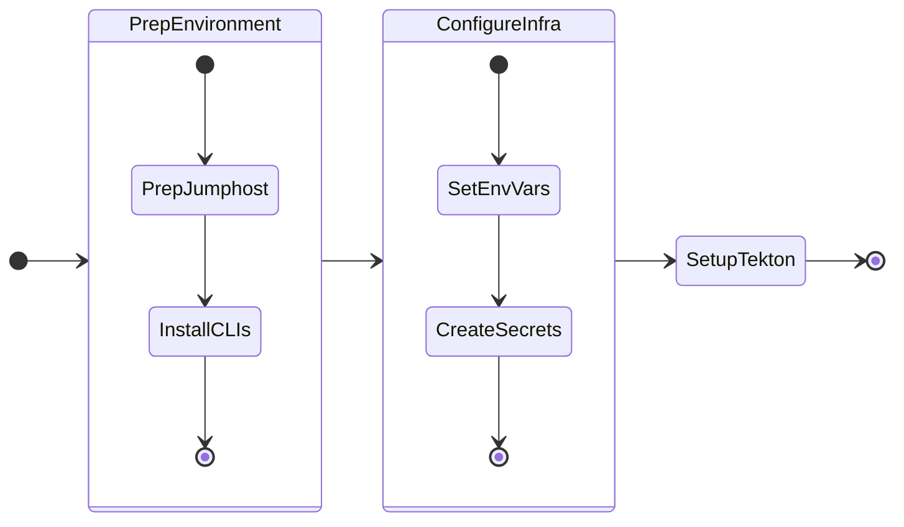

In this section we will setup pre-requisites for CICD lab



## Pre-requisites

!!! example "Lab Pre-requisites"

    1. Existing Ubuntu Linux jumphost VM. See here for jumphost installation [steps](../infra/infra_jumphost_tofu.md).
    2. [Docker](#setup-docker-on-jumphost) or Podman installed on the jumphost VM
    3. Nutanix PC is at least ``pc.7.5.0.1``
    4. Nutanix AOS is at least ``7.3.0.5``
    5. Download and install tekton ``0.44.1`` and flux ``2.8.5`` binaries from respective portals

Deploy the NKP workload cluster with the following components:

 * 1 x Control plane nodes
 * 2 x Worker nodes
 * 1 x Available Ingress IP
 
Below are minimum requirements for this lab to deploy CICD on the NKP workload cluster.

| Role          | No. of Nodes (VM) | vCPU per Node | Memory per Node | Storage per Node | 
|---------------|-------------------|---------------|-----------------|------------------|
| Control plane | 1                 | 8             | 16 GB           | 200 GB           | 
| Worker        | 2                 | 8             | 16 GB           | 200 GB           | 
| **Totals**    | **3**             | **24**        | **48 GB**       | **400 GB**       |


## Install Tools on Jumphost VM

### Install Tekton Client 

1. Login to [Tekton Releases Download Page](https://github.com/tektoncd/cli/releases)
2. Select Tekton for Linux ``x86_64`` and copy the download link to the ``.tar.gz`` file
3. If you haven't already done so, Open new `VSCode` window on your jumphost VM

4. In `VSCode` Explorer pane, click on existing ``$HOME`` folder

5. Click on **New Folder** :material-folder-plus-outline: name it: ``cicd``

6. On `VSCode` Explorer plane, click the ``$HOME/cicd`` folder

7. On `VSCode` menu, select ``Terminal`` > ``New Terminal``

8. Browse to ``cicd`` directory

    === ":octicons-command-palette-16: Command"

        ```bash
        cd $HOME/cicd
        ```

9.  Download and extract the Tekton binary from the link you copied earlier for Linux ``x86_64``
    
    === ":octicons-command-palette-16: Command"

        ```bash
        curl -o tkn_0.44.1_Linux_x86_64.tar.gz "https://github.com/tektoncd/cli/releases/download/v0.44.1/tkn_0.44.1_Linux_x86_64.tar.gz"
        ```
        ```bash
        tar xvfz tkn_0.44.1_Linux_x86_64.tar.gz
        ```

10. Move the binary to a directory that is included in your ``PATH`` environment variable and enable ``kubectl`` tekton plugin

    === ":octicons-command-palette-16: Command"
   
        ```bash
        sudo mv tkn /usr/local/bin/
        ```

11. Verify the ``tkn`` binary is installed correctly 
    
    !!! note

        At the time of writing this lab tkn version is ``0.44.1``

    === ":octicons-command-palette-16: Command"

        ```bash
        tkn version
        ```

    === ":octicons-command-palette-16: Command Output"

        ```{ .text .no-copy }
        $ tkn 
        #
        Client version: 0.44.1
        Pipeline version: v1.6.0
        Triggers version: v0.34.0
        ```

### Install Flux Client

1. Browse to ``cicd`` directory

    === ":octicons-command-palette-16: Command"
    
        ```bash
        cd $HOME/cicd
        ```

2.  Download and install the ``flux`` binary

    === ":octicons-command-palette-16: Command"
    
        ```bash
        curl -s https://fluxcd.io/install.sh | sudo bash
        ```
    
    === ":octicons-command-palette-16: Command output"
    
        ```{ .text .no-copy }
        $ curl -s https://fluxcd.io/install.sh | sudo bash
        #
        [INFO]  Downloading metadata https://api.github.com/repos/fluxcd/flux2/releases/latest
        [INFO]  Using 2.8.5 as release
        [INFO]  Downloading hash https://github.com/fluxcd/flux2/releases/download/v2.8.5/flux_2.8.5_checksums.txt
        [INFO]  Downloading binary https://github.com/fluxcd/flux2/releases/download/v2.8.5/flux_2.8.5_linux_amd64.tar.gz
        [INFO]  Verifying binary download
        [INFO]  Installing flux to /usr/local/bin/flux
        ```
     
3.  Verify the ``flux`` binary is installed correctly. Ensure the version is latest
    
    !!! note

        At the time of writing this lab tkn version is ``0.44.1``

    === ":octicons-command-palette-16: Command"

        ```bash
        flux -v 
        ```

    === ":octicons-command-palette-16: Command Output"

        ```{ .text .no-copy }
        $ flux -v
        #
        flux version 2.8.5
        ```

### Configure Secrets, SA and RBAC

1. In the ``cicd`` folder, click on **New File** :material-file-plus-outline: and create new file with the following name:
  
    === ":octicons-file-code-16: ``.env``"

        ```text
        .env
        ```

2. Open ``$HOME/cicd/.env`` file in VSC and add (append) the following environment variables to your ``.env`` file and save it
   
    === "Template ``.env``"

        ```bash
        export REGISTRY_URL=_your_registry_url
        export REGISTRY_USERNAME=_your_registry_username
        export REGISTRY_PASSWORD=_your_registry_password
        export REGISTRY_CACERT=_path_to_ca_cert_of_registry  # (1)!
        # Optional if using Docker - Public Docker Registry Details
        export DOCKER_REGISTRY_URL=_your_registry_url
        export DOCKER_REGISTRY_USERNAME=_your_registry_username
        export DOCKER_REGISTRY_PASSWORD=_your_registry_password
        ```

        1. File must contain CA server and Harbor server's public certificate in one file

    === "Sample ``.env``"

        ```bash
        export REGISTRY_URL=https://harbor.10.x.x.111.nip.io/nkp
        export REGISTRY_USERNAME=admin
        export REGISTRY_PASSWORD=xxxxxxxx
        export REGISTRY_CACERT=$HOME/harbor/certs/full_chain.pem  # (1)!
        # Optional if using Docker - Public Docker Registry Details
        export DOCKER_REGISTRY_URL=https://index.docker.io/v1/
        export DOCKER_REGISTRY_USERNAME=dockeruser
        export DOCKER_REGISTRY_PASSWORD=_XXXXXXXXXX
        ```

        2. File must contain CA server and Harbor server's public certificate in one file

3. Source the new variables and values to the environment
   
     ```bash
     cd $HOME/cicd/
     source .env
     ```


4. Configure Tekton with either Docker or Harbor registry
   
    === ":octicons-command-palette-16: Harbor command"
    
        ```bash
        kubectl create secret docker-registry harbor-credentials \
        --namespace=default \
        --docker-server=$REGISTRY_URL \
        --docker-username=$REGISTRY_USERNAME \
        --docker-password=$REGISTRY_PASSWORD

        kubectl annotate secret docker-credentials \
        tekton.dev/docker-0=$REGISTRY_URL \
        --namespace=default
        ```
    
    === ":octicons-command-palette-16: Docker command"
    
        ```bash
        kubectl create secret docker-registry docker-credentials \
        --namespace=default \
        --docker-server=$DOCKER_REGISTRY_URL \
        --docker-username=$DOCKER_REGISTRY_USERNAME \
        --docker-password=$DOCKER_REGISTRY_PASSWORD

        kubectl annotate secret harbor-credentials \
        tekton.dev/docker-0=$DOCKER_REGISTRY_URL\
        --namespace=default
        ```
    
    === ":octicons-command-palette-16: Command output"
    
        ```bash
        ```
   
5. Create the Tekton service account (sa)
   
    === ":octicons-command-palette-16: Harbor Command"
    
        ```bash
        k apply -f -<<
        apiVersion: v1
        kind: ServiceAccount
        metadata:
          name: tekton-build-sa
          namespace: default
        secrets:
          - name: harbor-credentials
        EOF
        ```
    
    === ":octicons-command-palette-16: Docker command"
    
        ```bash
        k apply -f -<<
        apiVersion: v1
        kind: ServiceAccount
        metadata:
          name: tekton-build-sa
          namespace: default
        secrets:
          - name: docker-credentials
        EOF
        ```
    
    === ":octicons-command-palette-16: Command output"
    
        ```bash
        ```

All pre-requisites are now setup. Go to next section for Continuous Integration (CI) setup.