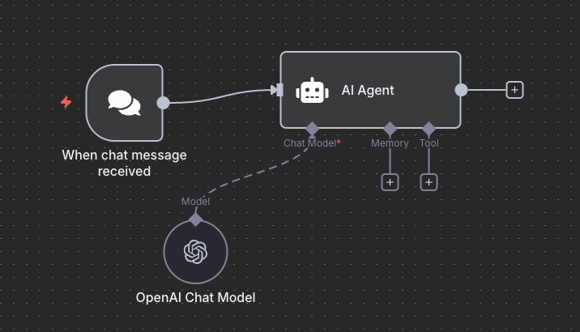
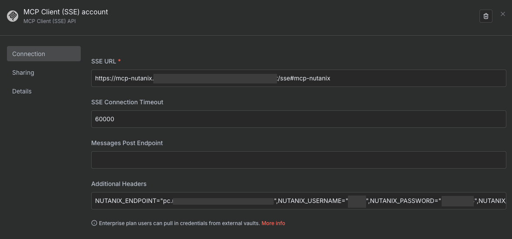
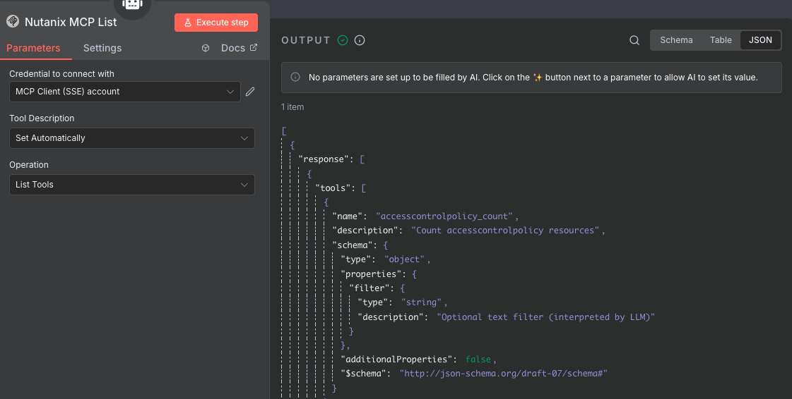
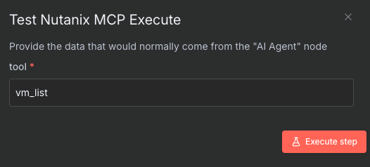
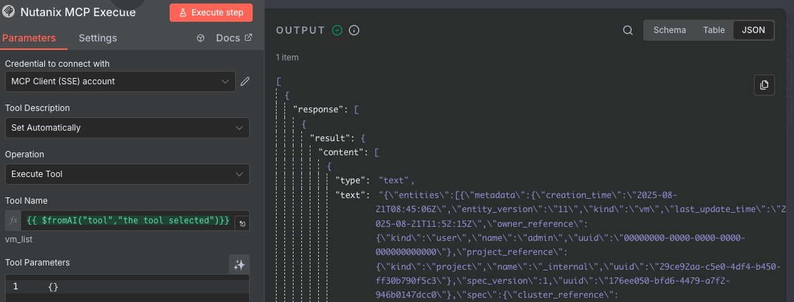
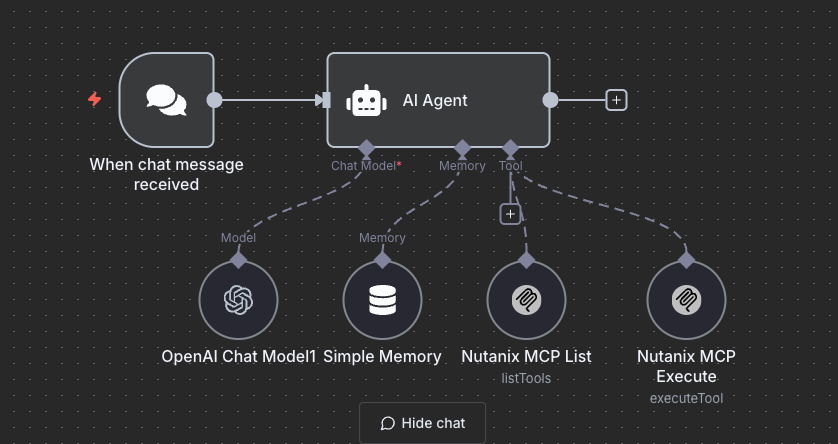

This lab is a continuation of the MCP lab with N8N server as an interfacing tool. 


## High-Level Overview

1. Install [n8n](https://n8n.io/) AI workflow automation tool
2. Configure [n8n](https://n8n.io/) MCP Client to connect to Nutanix MCP Server and chat (ask questions)


## Install N8N

[N8N](https://docs.n8n.io/) is a a fair-code licensed workflow automation tool that combines AI capabilities with business process automation.

We will install and self-host N8N on the NKP Server and use it to automate a chat AI Agent node using the Nutanix MCP Server which we deployed in the previous section. 

1. Log in to your Linux Tools VM (e.g., via VSCode as `ubuntu`). and open Terminal
   
2. Download [N8N Manifests](https://github.com/n8n-io/n8n-hosting) to deploy N8N in NKP cluster
   
    ```bash
    mkdir $HOME/n8n
    cd $HOME/n8n
    git clone https://github.com/n8n-io/n8n-hosting.git
    cd n8n-hosting/
    ```

3. Add the following n8n community node for use as tools with our AI Agent Node. We will do this by modifying the manifest file before deploying n8n.
   
    ```bash
    cd n8n-hosting/kubernetes/
    code n8n-deployment.yaml  # (1)  
    ```

    1. Use ``vim`` as an alternate editor

4. Add the following highlighted lines to the ``n8n-deployment.yaml`` file under the ``env`` section
   
    ```yaml hl_lines="9 10"
       env:
         < Snipped for brevity >
         - name: N8N_PROTOCOL
           value: http
         - name: N8N_PORT
           value: "5678"
         - name: NODE_TLS_REJECT_UNAUTHORIZED
           value: "false"
         - name: N8N_COMMUNITY_PACKAGES_ALLOW_TOOL_USAGE
           value: "true"
    ```

5. Deploy ``n8n``
    
    === "Command"

        ```bash
        export KUBECONFIG=$HOME/_nkp_install_dir/_nkpclustername.conf
        kubectl apply -f . 
        ```

    === "Command output"

        ```{ .text .no-copy }
        export KUBECONFIG=$HOME/nkp/nkpdev.conf
        #
        httproute.gateway.networking.k8s.io/n8n-chatapp-route created
        persistentvolumeclaim/n8n-claim0 created
        deployment.apps/n8n created
        service/n8n created
        namespace/n8n created
        persistentvolumeclaim/postgresql-pv created
        configmap/init-data created
        deployment.apps/postgres created
        secret/postgres-secret created
        service/postgres-service created
        ```

6. Check ``n8n`` services 
    
    === "Command"

        ```bash
        kubens n8n 
        kubectl get all
        ```

    === "Command output"

        ```{ .text .no-copy }
        Active namespace is "n8n".
        #
        NAME                            READY   STATUS    RESTARTS        AGE
        pod/n8n-cf6b5b8db-ql5db         1/1     Running   0               2m
        pod/postgres-57dbbcbb58-mpnq8   1/1     Running   1 (2m ago)      2m
        
        NAME                       TYPE           CLUSTER-IP    EXTERNAL-IP   PORT(S)          AGE
        service/n8n                LoadBalancer   10.99.29.36   <pending>     5678:32488/TCP   2m
        service/postgres-service   ClusterIP      None          <none>        5432/TCP         2m
        
        NAME                       READY   UP-TO-DATE   AVAILABLE   AGE
        deployment.apps/n8n        1/1     1            1           2m
        deployment.apps/postgres   1/1     1            1           2m
        
        NAME                                  DESIRED   CURRENT   READY   AGE
        replicaset.apps/n8n-bc8878667         0         0         0       2m
        replicaset.apps/n8n-cf6b5b8db         1         1         1       2m
        replicaset.apps/postgres-57dbbcbb58   1         1         1       2m
        ```

7.  If Envoy Gateway is installed as a part of NAI install use the following to create a ``HTTPRoute`` resource to access n8n
     ```bash
     kubectl apply -f -<<EOF
     apiVersion: gateway.networking.k8s.io/v1
     kind: HTTPRoute
     metadata:
       name: n8n-chatapp-route
       namespace: n8n                    # Same namespace as your chat app service
     spec:
       parentRefs:
       - name: nai-ingress-gateway
         namespace: nai-system           # Namespace of the Gateway
       hostnames:
       - "n8n.nai.10.x.x.216.nip.io"     # Input Gateway IP address
       rules:
       - matches:
         - path:
             type: PathPrefix
             value: /
         backendRefs:
         - name: n8n
           kind: Service
           port: 5678
     EOF
     ```

8. Now n8n will be available at the following URL ``n8n.nai.10.x.x.216.nip.io``
9. Register for n8n with an email
10. An activation key will be sent to email address

## Setup N8N Workflow with Nutanix MCP Server

This workflow is a simple example of how to use the MCP server for Nutanix in an N8N workflow. It uses the
AI Agent node to interact with the MCP server via the MCP Client node. In the following workflow, we'll be
using the ``n8n-nodes-mcp`` community node to interact with the Nutanix MCP server.

1. Add Community Node ``n8n-node-mcp`` to n8n instance under **Settings**
   
    

2. Add AI Agent node to workflow and Configure OpenAI Chat Model, Simple Memory and other settings as needed.
    
    For the prompt, use the following:

    ```text
    You are an AI agent that can interact with a Nutanix cluster using the MCP server.
    You can list VMs, get VM details, and perform actions like start, stop, and reboot VMs.
    Use the MCP Client node to execute commands on the Nutanix cluster.
    ```
    
    

4. Add the NAI LLM Model deployed [here](../../iep/iep_deploy.md#create-and-test-inference-endpoint) and set up with credentials
   
    - **API Key**: Use the one generated in NAI 
    - **Base URL**: ``https://nai.10.x.x.216.nip.io/api/v1``
   
    

5. Choose **Simple Memory** for storing in-flight data

6. Search and add ``MCP Client Tool`` (via npm) tool to workflow and name it **Nutanix MCP List**
   
7. For Credentials - create **New Credential** and Configure MCP Client node to use the Nutanix MCP server SSE endpoint
   
    **SSE URL**: 
     
    ```text
    https://mcp-nutanix.${INGRESS_IP}.nip.io/sse#mcp-nutanix
    ```

    **Additional Headers**: Copy and paste the following (with actual values for Nutanix Prism connectivity)
   
    ```text
    NUTANIX_ENDPOINT="$NUTANIX_ENDPOINT",NUTANIX_USERNAME="$NUTANIX_USERNAME",NUTANIX_PASSWORD="$NUTANIX_PASSWORD",NUTANIX_INSECURE="true"
    ```

    

8. Run **Execute Step** to test connection and view available commands
   
    

9. Add another **MCP Client** (via npm) tool node to workflow and name it something meaningful like **Nutanix MCP Execute**
10. For credential use the Nutanix MCP server SSE endpoint (previously configured)
11. For Tool Name, select Expression tab and provide following
   
    ```json
    {{ $fromAI("tool","the tool selected") }}
    ```

12. Click on **Execute Step**

13. Type ``vm_list``  in the input text box and click on **Execute Step**
    
     
    
     
    
14. Run the workflow to verify configuration
     
     

15. In the AI Chat window, ask questions about the Nutanix cluster
    
     