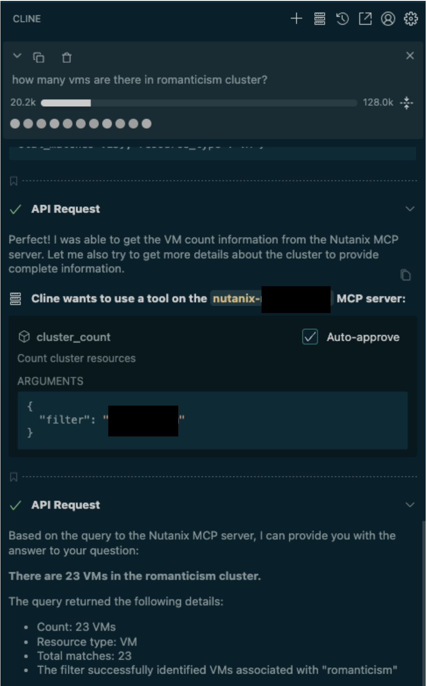

# Nutanix MCP Server

This lab walks through a Nutanix Model Context Protocol (MCP) server to get details from a Nutanix Prism cluster using MCP implementation.

This lab is aimed to illustrate implementing MCP servers on Nutanix using Nutanix solutions (NKP and NAI).

!!! warning
    MCP Nutanix is an experimental project at this time. See [Nutanix MCP gitrepo](https://github.com/thunderboltsid/mcp-nutanix.git) for details. 

    This project was created as a personal project to explore the capabilities of the Model Context Protocol frameworks in Go. It is:

    - NOT an official Nutanix product or tool
    - NOT supported, endorsed, or maintained by Nutanix
    - NOT suitable for production environments
    - PROVIDED AS-IS with no warranties or guarantees

!!! info "Lab Duration"
    Estimated time to complete this lab is **30 minutes** provided NKP and NAI are ready to use

## Pre-requisites

- Nutanix Kubernetes Platform NKP cluster ``v1.16`` or later deployed, accessible via `kubectl`. See [NKP Deployment](../infra/infra_nkp.md) for NKP install instructions.
- Nutanix CSI driver installed for storage integration. (pre-installed with NKP)
- Networking configured to allow communication between the Kubernetes cluster and NAI.
- Envoy Gateway controller installed for external access (pre-installed during NAI install)
  - Optional - Traefik Ingress controller installed for external access (pre-installed during NAI install)
- Linux Tools VM or equivalent environment with `kubectl`, `helm`, `curl`, and `jq` installed.
- NAI ``v2.4.0`` or later server credentials and hosted LLM (gemini 2B as an example)
  - Optional - access to publicly available LLM

## High-Level Overview

1. Deploy Toolhive Operator in NKP (kubernetes) cluster
2. Deploy MCP server for Nutanix in NKP cluster
3. Configure Ingress for Nutanix MCP Server
4. Install [n8n](https://n8n.io/) AI workflow automation tool
5. Configure [n8n](https://n8n.io/) MCP Client to connect to Nutanix MCP Server and chat (ask questions)

## Deploy Toolhive Operator in NKP (kubernetes) cluster

### Install THV

[Toolhive](https://docs.stacklok.com/toolhive) is used to simplify deployment and management of MCP servers. 

We will install THV on the jumpbox to build our MCP server. 

1. Log in to your Linux Tools VM (e.g., via SSH as `ubuntu`).
   
9.  Download and install [stable](https://github.com/stacklok/toolhive/releases/) ``thv`` binaries
   
    ```bash
    mkdir $HOME/mcp
    cd $HOME/mcp
    curl -o toolhive_0.3.7_linux_amd64.tar.gz "https://github.com/stacklok/toolhive/releases/download/v0.3.7/toolhive_0.3.7_linux_amd64.tar.gz"
    ```
 
    ```
    tar -xzf toolhive_0.3.7__amd64.tar.gz
    sudo mv thv /usr/local/bin/
    sudo chmod +x /usr/local/bin/thv
    ```

10. Verify ``thv`` version
     
    === "Command"

        ```bash
        thv version
        ```
 
    === "Command output"
        
        ```{ .text .no-copy }
        ToolHive v0.3.7
        Commit:.  abb22d80a5321342530583bbc82aeadef718e943
        Built: 2025-10-06 08:45:05 UTC
        Go version: go1.24.4
        Platform: linux/amd64
        ```

## Prepare MCP Server Image


5. Login to VSC on the jumphost VM, append the following environment variables to the ``$HOME\mcp\.env`` file and save it
   
    === "Template .env"

        ```bash
        export REGISTRY_URL=_your_registry_url
        export REGISTRY_HOST=_your_registry_host
        export REGISTRY_USERNAME=_your_registry_username
        export REGISTRY_PASSWORD=_your_registry_password
        export REGISTRY_CACERT=_path_to_ca_cert_of_registry  # (1)!
        ```

        1. File must contain CA server and Harbor server's public certificate in one file

    === "Sample .env"

        ```bash
        export REGISTRY_URL=https://harbor.10.x.x.111.nip.io/nkp
        export REGISTRY_URL=harbor.10.x.x.111.nip.io/nkp
        export REGISTRY_USERNAME=admin
        export REGISTRY_PASSWORD=xxxxxxxx
        export REGISTRY_CACERT=$HOME/harbor/certs/full_chain.pem
        ```

11. Create Docker file to build MCP server image for Nutanix
   
    ```bash
    thv build --tag mcp-nutanix:latest go://github.com/thunderboltsid/mcp-nutanix@latest -o Dockerfile
    ```

12. Create container image
    
    ```bash
    thv build --tag mcp-nutanix:latest go://.
    ```

13. Validate that docker architecture matches linux/amd64
    
    === "Command"
    
        ```bash
        docker image inspect mcp-nutanix:latest --format '{{.Architecture}}{{.Os}}'
        ```

    === "Command output"
    
        ```bash
        amd64linux
        ```

14. Upload to a private container registry to be able to deploy in Kubernetes
   

    === "Command"
    
        ```bash
        docker login ${REGISTRY_HOST} -u ${REGISTRY_USERNAME} -p ${REGISTRY_PASSWORD}
        docker tag mcp-nutanix:latest ${REGISTRY_HOST}/mcp-nutanix:latest
        docker push ${REGISTRY_HOST}/mcp-nutanix:latest
        ```

    === "Command output"
    
        ```bash
        Login Succeeded

        The push refers to repository [harbor.10.x.x.124/nkp/mcp-nutanix]
        667e3f0433e8: Pushed 
        d03eeff57712: Pushed 
        73e1ce48ffe2: Pushed 
        06fb002250ae: Pushed 
        256f393e029f: Pushed 
        latest: digest: sha256:852ca2e96f5a288e10cd058c38dc5a22ffb7003b41cda5faa28ba794d36154e6 size: 1363
        ```

1.  Configure `kubectl` to access your NKP Kubernetes cluster:
   
    === "Command"
 
         ```bash
         export KUBECONFIG=$HOME/_nkp_install_dir/nkpclustername.conf
         ```

    === "Sample command"
        
        ```{ .text .no-copy }
        export KUBECONFIG=$HOME/nkp/nkpdev.conf
        ```

2.  Install MCP server CRD in Kubernetes cluster
    
    === "Command"
    
        ```bash
        helm upgrade -i toolhive-operator-crds \
        oci://ghcr.io/stacklok/toolhive/toolhive-operator-crds
        ```

    === "Command output"

        ```{ .text .no-copy }
        oci://ghcr.io/stacklok/toolhive/toolhive-operator-crds
        Release "toolhive-operator-crds" does not exist. Installing it now.
        Pulled: ghcr.io/stacklok/toolhive/toolhive-operator-crds:0.0.33
        Digest: sha256:aa24f2ddcd93b0582a5f9edf3465bdab835d62e6dcbf969f63666604815f502e
        NAME: toolhive-operator-crds
        LAST DEPLOYED: Fri Oct 10 02:30:44 2025
        NAMESPACE: n8n
        STATUS: deployed
        REVISION: 1
        TEST SUITE: None
        ```

3.  Install Toolhive operator
   
    === "Command"
    
        ```bash
        helm upgrade -i toolhive-operator \
        oci://ghcr.io/stacklok/toolhive/toolhive-operator \
        -n toolhive-system --create-namespace
        ```

    === "Command output"

        ```{ .text .no-copy }
        Release "toolhive-operator" does not exist. Installing it now.
        Pulled: ghcr.io/stacklok/toolhive/toolhive-operator:0.2.20
        Digest: sha256:ad78fd2ca7c8eac82ac3d071b6a110853095b66c22e0cc4d6f2e6a9d03aea69a
        NAME: toolhive-operator
        LAST DEPLOYED: Fri Oct 10 02:34:29 2025
        NAMESPACE: toolhive-system
        STATUS: deployed
        REVISION: 1
        TEST SUITE: None
        ```

4.  Verify Toolhive installation
    
    === "Command"
    
        ```bash
        kubens toolhive-system
        kubectl get pods
        ```

    === "Command output"
    
        ```{ .text .no-copy }
        NAME                                 READY   STATUS    RESTARTS   AGE
        toolhive-operator-5bcb8dbfd4-2zmzw   1/1     Running   0          53s
        ```


## Deploy MCP server for Nutanix in NKP cluster

1. Append the following variables to .env file for Nutanix Prism information
   
    === "Template .env"

        ```text
        export NUTANIX_USERNAME=_your_nutanix_username
        export NUTANIX_PASSWORD=_your_nutanix_password
        export NUTANIX_ENDPOINT=_your_prism_central_fqdn
        ```

    === "Sample .env"

        ```text
        export NUTANIX_USERNAME=admin
        export NUTANIX_PASSWORD=xxxxxxxx
        export NUTANIX_ENDPOINT=pc.example.com
        ```

2. Create docker registry secret to pull mcp-nutanix image from private harbor repository
   
    ```bash
    kubectl create secret docker-registry regcred \
    --docker-server=${REGISTRY_URL} \
    --docker-username=${REGISTRY_USERNAME} \
    --docker-password=${REGISTRY_PASSWORD} \
    -n toolhive-system
    ```

3. Deploy MCP server for Nutanix using the pushed image from private harbor repository

    ```bash
    cat <<EOF | kubectl apply -f -
    apiVersion: toolhive.stacklok.dev/v1alpha1
    kind: MCPServer
    metadata:
      name: nutanix
      namespace: toolhive-system
    spec:
      image: ${REGISTRY_HOST}/mcp-nutanix:latest
      transport: stdio
      port: 8080
      permissionProfile:
        type: builtin
        name: network
      env:
      - name: NUTANIX_ENDPOINT
        value: "${NUTANIX_ENDPOINT}"
      - name: NUTANIX_USERNAME
        value: "${NUTANIX_USERNAME}"
      - name: NUTANIX_PASSWORD
        value: "${NUTANIX_PASSWORD}"
      - name: NUTANIX_INSECURE
        value: "true"
      podTemplateSpec:
        spec:
          imagePullSecrets:
          - name: regcred
          containers:
            - name: mcp
              resources:
                limits:
                  cpu: "500m"
                  memory: "512Mi"
                requests:
                  cpu: "100m"
                  memory: "128Mi"
      resources:
        limits:
          cpu: "100m"
          memory: "128Mi"
        requests:
          cpu: "50m"
          memory: "64Mi"
    EOF
    ```

4. Check the health of the ``MCPServer`` resource and make sure it is running
   
    === "Template command"
 
        ```bash
        kubectl get mcpserver
        ```
 
    === "Command output"
    
        ```bash
        NAME      STATUS    URL                                                               AGE
        nutanix   Running   http://mcp-nutanix-proxy.toolhive-system.svc.cluster.local:8080   78s
        ```


5. Expose MCP Server ``Ingress`` for external access. We will be using the pre-deployed ``Traefik`` ingress that comes with NKP and expose MCP server as a subdomain.
   
6. Get the IP address of the NKP pre-deployed Traefik Ingress
   
    ```bash
    INGRESS_IP=$(kubectl get ingress kommander-kommander-ui -n kommander -o jsonpath='{.status.loadBalancer.ingress[0].ip}')
    ```

    ```bash
    kubectl apply -f -<<EOF
    apiVersion: networking.k8s.io/v1
    kind: Ingress
    metadata:
      name: mcp-nutanix-proxy-ingress
      namespace: toolhive-system
      annotations:
        kubernetes.io/ingress.class: kommander-traefik
        traefik.ingress.kubernetes.io/router.tls: "false"
    spec:
      rules:
      - host: mcp-nutanix.${INGRESS_IP}.io
        http:
          paths:
          - backend:
              service:
                name: mcp-nutanix-proxy
                port:
                  number: 8080
            path: /
            pathType: Prefix
    EOF
    ```

7. Check the health of ``MCPServer`` resource

    === "Template command"

        ```bash
        curl -k https://mcp-nutanix.10.x.x.215.nip.io/health
        ```

    === "Command output"

        ```{ .text .no-copy }
        {"status":"healthy","timestamp":"2025-10-10T02:57:16.51932436Z","version":{"version":"v0.3.7","commit":"abb22d80a5321342530583bbc82aeadef718e943","build_date":"2025-10-06 11:31:07 +0300","go_version":"go1.24.4","platform":"linux/amd64"},"transport":"stdio","mcp":{"available":true,"response_time_ms":0,"last_checked":"2025-10-10T02:57:16.519338081Z"}}
        ```

8. Test the health of SSE endpoints

    === "Template command"

        ```bash
        curl -k -N -H "Accept: text/event-stream" https://mcp-nutanix.10.x.x.215.nip.io/sse#mcp-nutanix
        ```

    === "Command output"

        ```{ .text .no-copy }
        event: message
        data: {"jsonrpc":"2.0","id":"ping_1760065217411075629","result":{}}
        
        event: message
        data: {"jsonrpc":"2.0","id":"ping_1760065222410782180","result":{}}
        ```

## Testing MCP Server

### Using Cline

!!! tip
    
    [Cline Documentation](https://docs.cline.bot/mcp/configuring-mcp-servers) for MCP server setup instructions.

1. In **VSCode** > Go to **Settings** > **Extensions**
2. Search for **Cline** and **Install** (from the official developer Cline Inc.)
3. Sign up for **Cline** (for free LLM usage)
4. Use your favourtie LLM
5. Click the **MCP Servers** icon in the top navigation bar of the Cline extension
6. Select the **Configure** tab, and then Click the **Configure MCP Servers** link at the bottom of that pane.
7. **Cline** will open a new settings config file in VSCode. Paste the following _after_ changing your MCP server and Nutanix PC connection details
    
    === "Template file"

        ```json
        {
        "mcpServers": {
            "nutanix-pc": {
              "disabled": true,
              "timeout": 60,
              "type": "stdio",
              "command": "npx",
              "args": [
                "-y",
                "mcp-remote",
                "https://mcp-nutanix.${INGRESS_IP}$.nip.io/sse#mcp-nutanix",
                "--allow-http",
                "--transport sse-only"
              ],
              "env": {
                "NUTANIX_ENDPOINT": "$NUTANIX_ENDPOINT",
                "NUTANIX_USERNAME": "$NUTANIX_USERNAME",
                "NUTANIX_PASSWORD": "$NUTANIX_PASSWORD",
                "NUTANIX_INSECURE": "true"
              }
            }
        }
        }
        ```

    === "Sample file"

        ```json
        {
          "mcpServers": {
            "nutanix-pc": {
              "disabled": true,
              "timeout": 60,
              "type": "stdio",
              "command": "npx",
              "args": [
                "-y",
                "mcp-remote",
                "https://mcp-nutanix.10.x.x.215.nip.io/sse#mcp-nutanix",
                "--allow-http",
                "--transport sse-only"
              ],
              "env": {
                "NUTANIX_ENDPOINT": "pc.example.com",
                "NUTANIX_USERNAME": "admin",
                "NUTANIX_PASSWORD": "XXXXXXXXXXX",
                "NUTANIX_INSECURE": "true"
              }
            }
          }
        }
        ```

8. Save the **Cline** extension config file
   
9. Go to **Cline** chat and ask questions about the Nutanix PC environment

    


### Using N8N