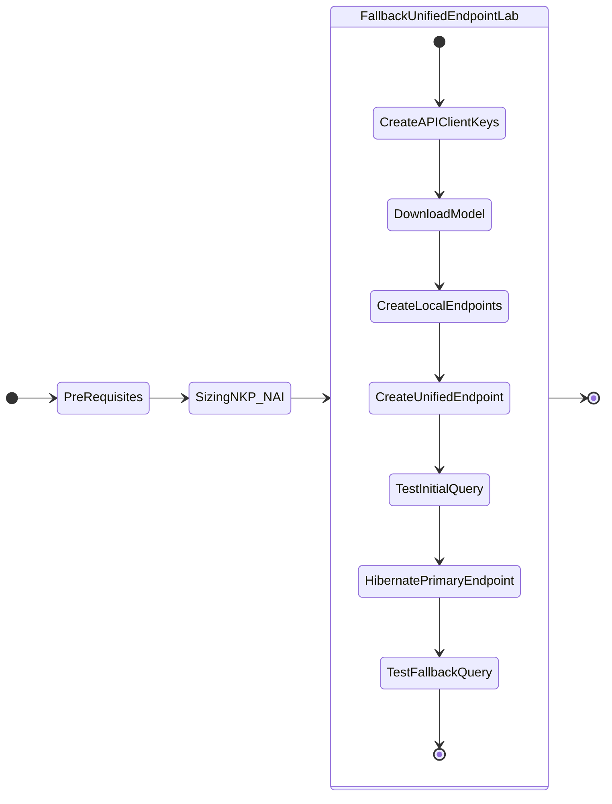
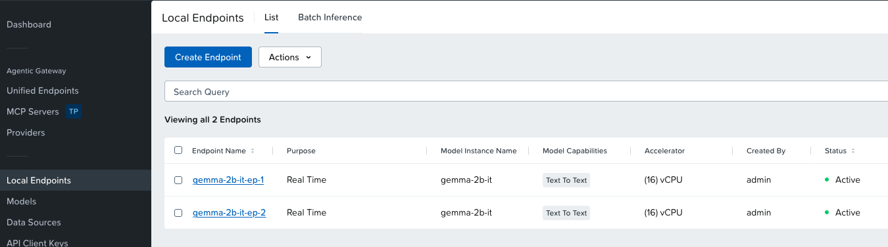
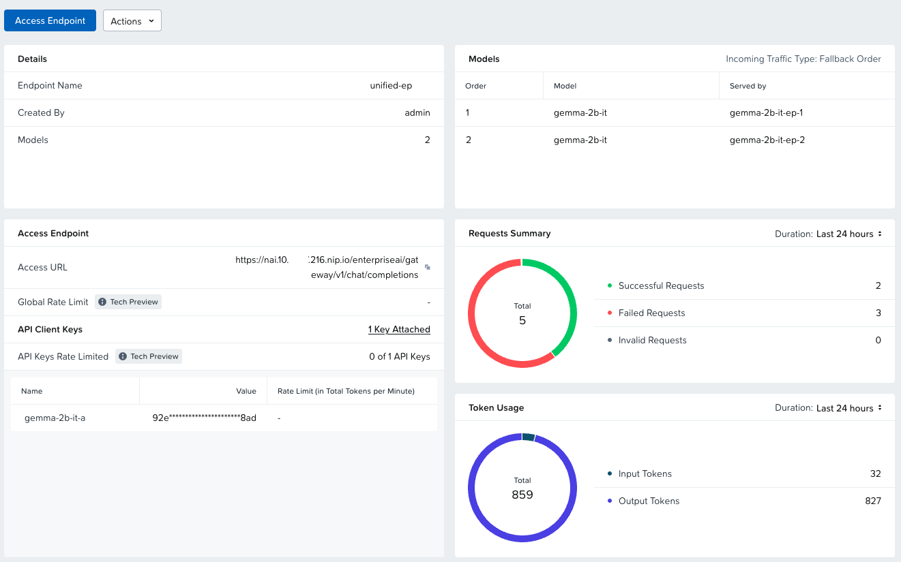

# Deploying Unified Endpoints



## Getting Started

To begin, log in to your Nutanix Enterprise AI UI. Navigate to the **Endpoints** section on the left-hand menu, and verify that your underlying cluster health is showing as optimal in the Infrastructure Summary. 

At a high level, we will do the following:

1. Download model
2. Create two endpoints
3. Configure Unified Endpoint with the two endpoints as backend

## Pre-requisites and Sizing

So far we have been working with initial NKP cluster that was created in this [section](../infra/infra_nkp.md#sizing-requirements)

We will need more resources for running the Unified Endpoint

**Current NKP Cluster:**

| Role          | No. of Nodes (VM) | vCPU per Node | Memory per Node | Storage per Node | Total vCPU | Total Memory |
|---------------|-------------------|---------------|-----------------|------------------|------------|--------------|
| Control plane | 3                 | 4             | 16 GB           | 150 GB           | 12         | 48 GB        |
| Worker        | 4                 | 12            | 32 GB           | 150 GB           | 36         | 128 GB       |
| GPU           | 1                 | 20            | 40 GB           | 300 GB           | 20         | 40 GB        |
| **Totals**    |                   |               |                 |                  | **68**     | **216 GB**   |

**Unified Endpoint Clusters:**

!!! note "Do you have GPU and/or CPUs available?"

    We can choose to create Unified Endpoint based on GPU or CPU depending on what is available. CPU is going to be slow. However, it is a worthwhile fallback as the CPU inferencing improvements are always evolving.

Here is sizing for GPU or CPU based Endpoints for ``gemma-2b-it`` model inferencing setup. Choose your preference or do a combination of GPU and CPU (GPU endpoint falling back to CPU endpoint)

=== "GPU Based Endpoints"

    | Role          | No. of Nodes (VM) | vCPU per Node | Memory per Node | Storage per Node | Total vCPU | Total Memory |
    |---------------|-------------------|---------------|-----------------|------------------|------------|--------------|
    | Control plane | 3                 | 4             | 16 GB           | 150 GB           | 12         | 48 GB        |
    | Worker        | 4                 | 12            | 32 GB           | 150 GB           | 36         | 128 GB       |
    | GPU           | 2                 | 20            | 40 GB           | 300 GB           | 40         | 80 GB        |
    | **Totals**    | **9**             |               |                 |                  | **88**     | **256 GB**   |

=== "CPU Based Endpoints"

    | Role          | No. of Nodes (VM) | vCPU per Node | Memory per Node | Storage per Node | Total vCPU | Total Memory |
    |---------------|-------------------|---------------|-----------------|------------------|------------|--------------|
    | Control plane | 3                 | 4             | 16 GB           | 150 GB           | 12         | 48 GB        |
    | Worker        | 6                 | 24            | 32 GB           | 150 GB           | 36         | 144 GB       |
    | **Totals**    | **9**             |               |                 |                  | **48**     | **192 GB**   |


### Increase Resources on NKP Cluster

We can use ``kubectl`` or NKP GUI to increase the NKP node resources.

---

**Change Resources using ``kubectl``:**

1. Run the following command to check K8S status of the NKP cluster
 
    === ":octicons-command-palette-16: Command"
    
        ```bash
        export KUBECONFIG=${NKP_CLUSTER_NAME}.conf
        ```

    === ":octicons-command-palette-16: Sample command"
    
        ```bash
        export KUBECONFIG=nkpmgt.conf
        ```

2. Get ``Cluster`` details
   
    === ":octicons-command-palette-16: Command"
    
        ```bash
        kubectl get clusters -A
        ```
    
    
    === ":octicons-command-palette-16: Command output"
    
        ```{ .text .no-copy }
        $ kubectl get clusters -A
        #
        NAMESPACE   NAME    CLUSTERCLASS          PHASE         AGE     VERSION
        default     nkpmgt  nkp-nutanix-v2.17.1   Provisioned   2d23h   v1.34.3
        ```

3. Edit the ``MachineDeployment`` details
    
    === ":octicons-command-palette-16: Command"
    
        ```bash
        kubectl edit cluster nkpmgt
        ```
    
4. Change the following parameters
   
    === ":octicons-command-palette-16: Increase CPU and RAM"

        ```yaml hl_lines="13 14"
        machineDeployments:
        - class: default-worker
          name: md-0
          # ... (metadata/annotations are up here) ...
          variables:
            overrides:
            - name: workerConfig
              value:
                # ...
                nutanix:
                  machineDetails:
                    # CHANGE THESE VALUES:
                    memorySize: 32Gi         # e.g., change to 32Gi from current
                    vcpuSockets: 24          # e.g., change to 24 from current
                    vcpusPerSocket: 1
        ```
    
    === ":octicons-command-palette-16: Increase Node Count"

        ```yaml hl_lines="5 6"
        machineDeployments:
        - class: default-worker
          metadata:
            annotations:
              cluster.x-k8s.io/cluster-api-autoscaler-node-group-max-size: "6" # e.g., change to 6 from current
              cluster.x-k8s.io/cluster-api-autoscaler-node-group-min-size: "6" # e.g., change to 6 from current
        ```

---

**Change Resources using GUI:**

1. In NKP Dashboard
2. Go to **Clusters**  > Select your cluster (In this lab we have used the **Kommander Host Management** ``nkpmgt`` cluster)
3. Go to **Nodepools**
4. Choose the GPU or CPU based workload Nodepools and increase resrouces (Nodes, CPU, and RAM)

---

## API Client Keys

Create API keys to use with our Unified Endpoints.

1. In the NAI GUI, go to **API Client Keys**
2. Click on **Create a New Key**
   
    - **Key Name**: ``gemma-2-2b-it-key``
  
3. Download or copy the contents of the key for use during testing.

## Download Model

We will download and user llama3 8B model which we sized for in the previous section.

1. In the NAI GUI, go to **Models**
2. Click on Import Model from Hugging Face
3. Choose the ``google/gemma-2-2b-it`` model
4. Input your Hugging Face token that was created in the previous [section](../iep/iep_pre_reqs.md#create-a-hugging-face-token-with-read-permissions) and click **Import**

5. Provide the Model Instance Name as ``google/gemma-2-2b-it`` and click **Import**

6. Go to VSC Terminal to monitor the download
    
    === ":octicons-command-palette-16: Command"

        ```bash title="Get jobs in nai-admin namespace"
        kubens nai-admin
        
        kubectl get jobs
        ```
        ```bash title="Validate creation of pods and PVC"
        kubectl get po,pvc
        ```
        ```bash title="Verify download of model using pod logs"
        kubectl logs -f _pod_associated_with_job
        ```

    === ":octicons-command-palette-16: Command output"

        ```text title="Get jobs in nai-admin namespace"
        kubens nai-admin

        ✔ Active namespace is "nai-admin"
     
        kubectl get jobs

        NAME                                       COMPLETIONS   DURATION   AGE
        nai-c0d6ca61-1629-43d2-b57a-9f-model-job   0/1           4m56s      4m56
        ```
        ```text title="Validate creation of pods and PVC"
        kubectl get po,pvc

        NAME                                             READY   STATUS    RESTARTS   AGE
        nai-c0d6ca61-1629-43d2-b57a-9f-model-job-9nmff   1/1     Running   0          4m49s

        NAME                                       STATUS   VOLUME                                     CAPACITY   ACCESS MODES   STORAGECLASS      VOLUMEATTRIBUTESCLASS   AGE
        nai-c0d6ca61-1629-43d2-b57a-9f-pvc-claim   Bound    pvc-a63d27a4-2541-4293-b680-514b8b890fe0   28Gi       RWX            nai-nfs-storage   <unset>                 2d
        ```
        ```text title="Verify download of model using pod logs"
        kubectl logs -f nai-c0d6ca61-1629-43d2-b57a-9f-model-job-9nmff 

        /venv/lib/python3.9/site-packages/huggingface_hub/file_download.py:983: UserWarning: Not enough free disk space to download the file. The expected file size is: 0.05 MB. The target location /data/model-files only has 0.00 MB free disk space.
        warnings.warn(
        tokenizer_config.json: 100%|██████████| 51.0k/51.0k [00:00<00:00, 3.26MB/s]
        tokenizer.json: 100%|██████████| 9.09M/9.09M [00:00<00:00, 35.0MB/s]<00:30, 150MB/s]
        model-00004-of-00004.safetensors: 100%|██████████| 1.17G/1.17G [00:12<00:00, 94.1MB/s]
        model-00001-of-00004.safetensors: 100%|██████████| 4.98G/4.98G [04:23<00:00, 18.9MB/s]
        model-00003-of-00004.safetensors: 100%|██████████| 4.92G/4.92G [04:33<00:00, 18.0MB/s]
        model-00002-of-00004.safetensors: 100%|██████████| 5.00G/5.00G [04:47<00:00, 17.4MB/s]
        Fetching 16 files: 100%|██████████| 16/16 [05:42<00:00, 21.43s/it]:33<00:52, 9.33MB/s]
        ## Successfully downloaded model_files|██████████| 5.00G/5.00G [04:47<00:00, 110MB/s] 

        Deleting directory : /data/hf_cache
        ```

7. Optional - verify the events in the namespace for the pvc creation 
    
    === ":octicons-command-palette-16: Command"

        ```bash
        k get events | awk '{print $1, $3}'
        ```

    === ":octicons-command-palette-16: Command output"

        ```{ .text, .no-copy}
        $ k get events | awk '{print $1, $3}'
    
        3m43s Scheduled
        3m43s SuccessfulAttachVolume
        3m36s Pulling
        3m29s Pulled
        3m29s Created
        3m29s Started
        3m43s SuccessfulCreate
        90s   Completed
        3m53s Provisioning
        3m53s ExternalProvisioning
        3m45s ProvisioningSucceeded
        3m53s PvcCreateSuccessful
        3m48s PvcNotBound
        3m43s ModelProcessorJobActive
        90s   ModelProcessorJobComplete
        ```

8. Go to **NAI UI > Models > Model Access Control**
9. Choose **Hugging Face Model Hub** and click on **Modify Allowed List**
10. Select ```google/gemma-2-2b-it``` and click on **Save**. 

We are set with the model and permissions required to create a model.

## Create Inference Endpoints

In this section we will create an inference endpoint using the downloaded model.

!!! note

    Both GPU and CPU access are documented here. Choose the procedure available to you.

!!! info
       
    NAI from ``v2.3`` can host a model up to 7 billion parameters on CPU only Nutanix nodes

1. Navigate to **Inference Endpoints** menu and click on **Create Endpoint** button
2. Fill the following details based on GPU or CPU availability:
   
    === "CPU Access"

        - **Endpoint Name**: ``gemma-2-2b-it-ep-1``
        - **Model Instance Name**: ``Gemma 2B IT``
        - **Purpose**: Real Time
        - Model Instance Name: select ``gemma-2-2b-it``
        - **Acceleration Type**: CPU
        - **Endpoint Access - Api Client Keys** - ``gemma-2-2b-it-key``
        - **Inference Engine** - vLLM
        - **No of Instances**: ``1``
        - **vCPUs (Per Instance)** - leave default at ``16``
        - **Memory (Per Instance)** - leave default at ``23``

  
    === "GPU Access"

        - **Endpoint Name**: ``gemma-2-2b-it-ep-1``
        - **Model Instance Name**: ``Gemma 2B IT``
        - **Use GPUs for running the models** : ``Checked``
        - **No of GPUs (per instance)**:
        - **GPU Card**: ``NVIDIA-L40S`` (or other available GPU)
        - **Endpoint Access - Api Client Keys** - ``gemma-2-2b-it-key``
        - **Inference Engine**: - vLLM
        - **No of Instances**: ``1``

3. Confirm the setting and **Click** on **Create**
   
4. Monitor the ``nai-admin`` namespace to check if the services are coming up
   
    === ":octicons-command-palette-16: Command"

        ```bash
        kubens nai-admin
        kubectl get po,deploy
        ```

    === ":octicons-command-palette-16: Command output"
        
        ```{ .text .no-copy }
        kubens nai-admin
        get po,deploy
        NAME                                                     READY   STATUS        RESTARTS   AGE
        pod/llama8b-predictor-00001-deployment-9ffd786db-6wkzt   2/2     Running       0          71m

        NAME                                                 READY   UP-TO-DATE   AVAILABLE   AGE
        deployment.apps/llama8b-predictor-00001-deployment   1/1     1            0           3d17h
        ```

5. Check the events in the ``nai-admin`` namespace for resource usage to make sure there are no errors
   
    === ":octicons-command-palette-16: Command"
       
        ```bash
        kubectl get events -n nai-admin --sort-by='.lastTimestamp' | awk '{print $1, $3, $5}'
        ```

    === ":octicons-command-palette-16: Command output"
       
        ```bash
        $ kubectl get events -n nai-admin --sort-by='.lastTimestamp' | awk '{print $1, $3, $5}'

        110s FinalizerUpdate Updated
        110s FinalizerUpdate Updated
        110s RevisionReady Revision
        110s ConfigurationReady Configuration
        110s LatestReadyUpdate LatestReadyRevisionName
        110s Created Created
        110s Created Created
        110s Created Created
        110s InferenceServiceReady InferenceService
        110s Created Created
        ```

6. Once the services are running, check the status of the inference service
   
    === ":octicons-command-palette-16: Command"

        ```bash
        kubectl get isvc
        ```

    === ":octicons-command-palette-16: Command output"
        
        ```{ .text .no-copy }
        kubectl get isvc

        NAME      URL                                          READY   PREV   LATEST   PREVROLLEDOUTREVISION   LATESTREADYREVISION       AGE
        llama8b   http://llama8b.nai-admin.svc.cluster.local   True           100                              llama8b-predictor-00001   3d17h
        ```

7. Create the second endpoint with the following details based on GPU or CPU availability:
   
    === "CPU Access"

        - **Endpoint Name**: ``gemma-2-2b-it-ep-2``
        - **Model Instance Name**: ``Gemma 2B IT``
        - **Purpose**: Real Time
        - Model Instance Name: select ``gemma-2-2b-it``
        - **Acceleration Type**: CPU
        - **Endpoint Access - Api Client Keys** - ``gemma-2-2b-it-key``
        - **Inference Engine** - vLLM
        - **No of Instances**: ``1``
        - **vCPUs (Per Instance)** - leave default at ``16``
        - **Memory (Per Instance)** - leave default at ``23``

  
    === "GPU Access"

        - **Endpoint Name**: ``gemma-2-2b-it-ep-2``
        - **Model Instance Name**: ``Gemma 2B IT``
        - **Use GPUs for running the models** : ``Checked``
        - **No of GPUs (per instance)**:
        - **GPU Card**: ``NVIDIA-L40S`` (or other available GPU)
        - **Endpoint Access - Api Client Keys** - ``gemma-2-2b-it-key``
        - **Inference Engine** - vLLM
        - **No of Instances**: ``1``

8. Confirm availability of both endpoints either in the GUI or using ``kubectl`` commands
    
    
   
    === ":octicons-command-palette-16: Command"
    
        ```bash
        kubens nai-admin
        kubectl get isvc
        ```
    
    === ":octicons-command-palette-16: Command output"
    
        ```{ .text .no-copy }
        $ kubectl get isvc
        #
        NAME               URL                                             READY   PREV   LATEST   PREVROLLEDOUTREVISION   LATESTREADYREVISION   AGE
        gemma-2b-it-ep-1   http://gemma-2b-it-ep-1-nai-admin.example.com   True                                                                  21m
        gemma-2b-it-ep-2   http://gemma-2b-it-ep-2-nai-admin.example.com   True 
        ```

Now we are have everything to create a unified endpoint.

## Creating Your First Fallback Unified Endpoint

1. Navigate to **Unified Endpoints** menu and click on **Create Unified Endpoint** button
2. Fill the following details:

   - **Endpoint Name**: ``unified-ep``
   - **API Spec**: Chat

3. Click on **Add Model**
4. Choose ``Local``
5. Add the following  endpoints 
    
    - ``gemma-2-2b-it-ep-1``
    - ``gemma-2-2b-it-ep-2``
4. Click **Next** and select **Fallback Order**
   
    -  **Order 1:** ``gemma-2-2b-it-ep-1``
    -  **Order 2:** ``gemma-2-2b-it-ep-2``

5. Choose the following API Key

    -  **Key Name**: ``gemma-2-2b-it-key``

6. Confirm the configuration and
7. Click **Create**

!!! note

    The name of the unified endpoint ``unified-ep`` will be become the model name where we will be sending inferencing requests.
   
## Test Querying Inference Service API

1. Prepare the API key that was created in the previous [section](../iep/iep_deploy.md#create-and-test-inference-endpoint)

    === "Template command"

        ```bash
        export API_KEY=_your_endpoint_api_key
        ```

    === "Sample command"

        ```bash
        export API_KEY=5840a693-254d-41ef-a2d3-1xxxxxxxxxx
        ```

2. Construct your ``curl`` command using the API key obtained above, and run it on the terminal

    === "Command"

        ```bash hl_lines="6" title="Note the model name"
        curl -k -X 'POST' 'https://nai.10.x.x.216.nip.io/enterpriseai/gateway/v1/chat/completions' \
         -H "Authorization: Bearer $API_KEY" \
         -H 'accept: application/json' \
         -H 'Content-Type: application/json' \
         -d '{
             "model": "unified-ep-cpu",
             "messages": [
                 {
                 "role": "user",
                 "content": "What is the capital of France?"
                 }
             ],
             "stream": false
         }'
        ```

    === "Command output"

        ```json hl_lines="11"
        {
            "id": "9e55abd1-2c91-4dfc-bd04-5db78f65c8b2",
            "object": "chat.completion",
            "created": 1728966493,
            "model": "unified-ep-cpu",
            "choices": [
                {
                    "index": 0,
                    "message": {
                        "role": "assistant",
                        "content": "The capital of France is Paris. It is a historic city on the Seine River in the north-central part of the country. Paris is also the political, cultural, and economic center of France."
                    },
                    "finish_reason": "stop"
                }
            ],
            "usage": {
                "prompt_tokens": 17,
                "completion_tokens": 41,
                "total_tokens": 58
            },
            "system_fingerprint": ""
        }
        ```

We have a successful unified endpoint deployment.

3. Go to NAI UI > Unified Endpoints 
4. Select unified-ep-cpu
5. Check the Overview and Metrics
   
    

## Availability Testing

In this section we will hibernate one of the local endpoints we created to simulate non-availability of an endpoint and check if the inferencing works.

1. In NAI UI, go to **Local Endpoints**
2. Select ``gemma-2b-it-ep-1`` endpoint
3. Click on **Actions** drop-down menu and choose **Hibernate**
4. Type hibernate is confirmation window and click on **Hibernate**
5. Confirm hibernation
6. Go to command line and test a query
   
    !!! note

        If you are using CPU based endpoints, the output time will vary based on your CPU and Memory availability we set in the Sizing section.
   
    === ":octicons-command-palette-16: Command"
    
        ```bash
        curl -k -X 'POST' 'https://nai.10.122.7.216.nip.io/enterpriseai/gateway/v1/chat/completions'  
         -H "Authorization: Bearer $API_KEY"  
         -H 'accept: application/json'  -H 'Content-Type: application/json' 
         -d '{
              "model": "unified-ep-cpu",
              "messages": [
                {
                  "role": "user",
                  "content": "Explain Deep Neural Networks in simple terms"
                }
              ],
              "stream": false
        }'


        ```
    
    === ":octicons-command-palette-16: Command output"
    
        ```json
        {
        "id": "chatcmpl-a0d6d439ad6245fd",
        "object": "chat.completion",
        "created": 1780482080,
        "model": "unified-ep-cpu",
        "choices": [
            {
            "index": 0,
            "message": {
                "role": "assistant",
                "content": "Imagine you're teaching a dog a new trick. You don't tell them the whole \"How\" at once, right? You show them, give them feedback, and they learn over time. \n\nDeep neural networks are like that, yet for computers.  \n\n**Here's the simple breakdown:**\n\n* **It's a network of interconnected neurons:** Just like our brain has neurons, deep neural networks are made of  \"artificial neurons\" connected in layers.\n* **Data is the training phase:** To learn, these neural networks are fed tons of data (like pictures of cats or images showing numbers) and their task is to figure out patterns and relationships within the data. Each connection between neurons has a \"weight\" that gets adjusted as the network learns.\n* **Layers work together:**  Each layer in the network looks at the data in different ways.  The first layer analyzes the image, the second looks for shapes within the image, and the ultimate layer might identify what is being shown: a cat in the picture.\n\n**So, how do they \"learn?\"**\n\n* **Feedforward:** The network takes the data, does a search, compares the search to  known answers, and adjusts the weights slightly. \n* **Backpropagation:** This process where the network learns from its mistakes, correcting its searches based on how new data compares to its predictions. Like an expert dog trainer giving feedback after each mistake, guiding its learning.\n\n**What are they good at?**\n\n* **Image recognition:** Identifying objects in pictures (dogs, cats, sunsets, etc.)\n* **Speech recognition:** Understanding what we say and translating it into text. \n* **Predicting outcomes:** Forecasting stock prices, recommending movies, analyzing medical data.\n\n**Key takeaways:**\n\n* Deep neural networks are complex systems, but their inspiration comes from Our brain's complex learning process.\n* They learn from large datasets and adjust can quickly. \n* They're excellent at complex pattern recognition that computers struggle with.\n\n\n**Remember:** It's a simplified explanation. The actual implementation is much more technical, but this gives you a basic understanding. \n"
            },
            "finish_reason": "stop",
            "content_filter_results": {
                "hate": {
                "filtered": false
                },
                "self_harm": {
                "filtered": false
                },
                "sexual": {
                "filtered": false
                },
                "violence": {
                "filtered": false
                },
                "jailbreak": {
                "filtered": false,
                "detected": false
                },
                "profanity": {
                "filtered": false,
                "detected": false
                }
            }
            }
        ],
        "usage": {
            "prompt_tokens": 16,
            "completion_tokens": 448,
            "total_tokens": 464,
            "prompt_tokens_details": null,
            "completion_tokens_details": null
        },
        "system_fingerprint": ""
        }
        ```
    